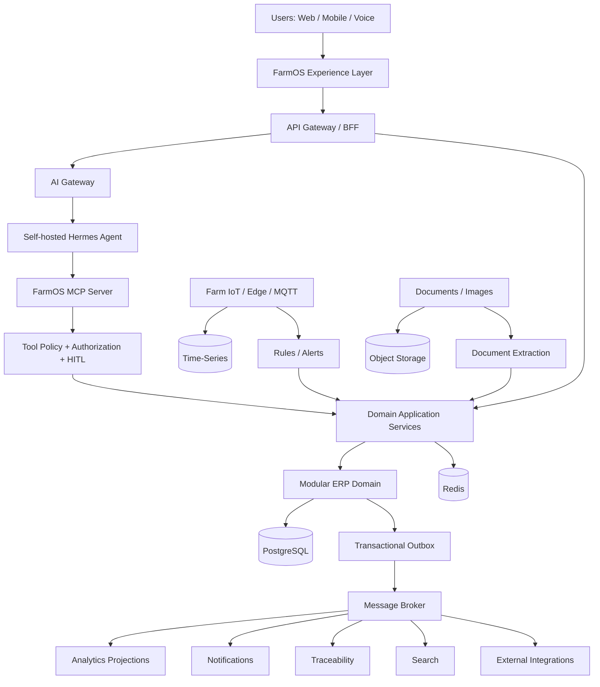
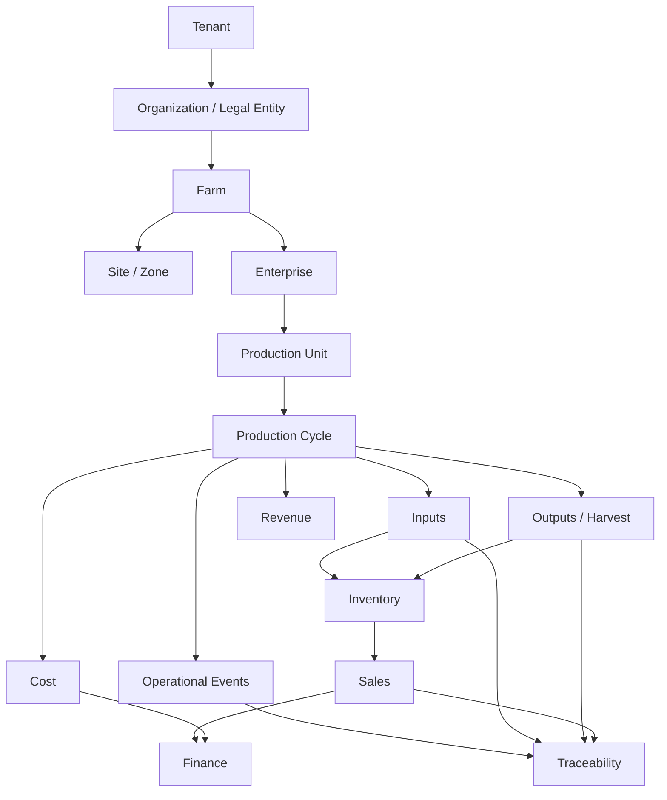
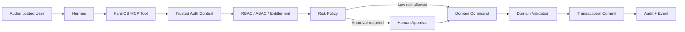
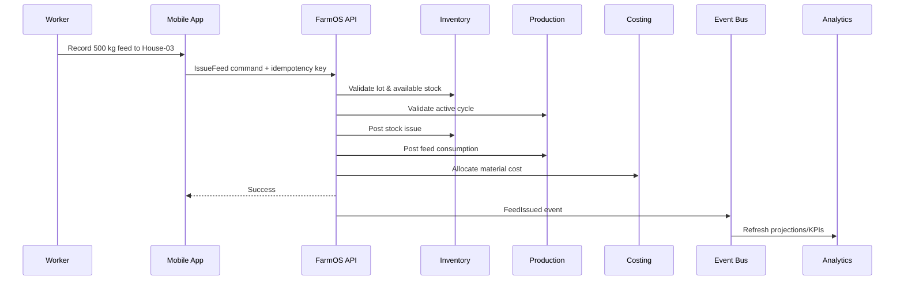

# FarmOS SaaS ERP
## End-to-End Product, Domain, AI, Data, Security, and Delivery Blueprint

**Document status:** Master product/technical blueprint  
**Version:** 1.0  
**Date:** 2026-09-22  
**Intended audience:** Founders, product managers, solution architects, backend/frontend/mobile engineers, AI engineers, DevOps/SRE, QA, security, farm-domain specialists, finance/accounting teams, implementation partners  
**Product type:** Multi-tenant Agriculture ERP SaaS with configurable mixed-farm operations, farm-to-market traceability, IoT/edge support, analytics, and Hermes-powered human-supervised agentic AI

---

# 1. Executive Summary

FarmOS should be built as a **configurable Agriculture Operating System**, not as separate software products for poultry, cattle, fisheries, and crops.

A tenant creates an organization, creates one or more farms, and composes each farm from the production enterprises and physical facilities that actually exist there. A single farm may contain broiler poultry, layers, dairy cattle, cattle fattening, fish ponds, crop fields, warehouses, feed stores, processing units, machinery, laboratories, and sales outlets. Another customer may operate only one fish farm. The same platform must support both without forcing irrelevant screens, workflows, or data fields on either customer.

The core operating principle is:

> **Capture a real-world event once, then automatically propagate all valid consequences to production, inventory, costing, finance, traceability, workflow, analytics, alerts, and AI.**

For example, when 500 kg of feed is issued to a broiler flock, the user should not separately update poultry production, warehouse stock, costs, FCR, traceability, reorder calculations, and profitability. One validated feed issue should trigger all of those consequences.

The core UX principle is:

> **Never ask the user for data the platform already knows, can derive, can scan, can import, can sense, or can safely infer and ask the user to confirm.**

The preferred data-capture order is:

1. Sensor/device capture
2. Existing system integration
3. QR/RFID/barcode scanning
4. Document extraction/OCR
5. Deterministic derivation
6. Template/default
7. Voice or conversational input
8. Minimal manual form entry

Hermes Agent should be used as the **agent orchestration and conversational tool-use layer**, but not as the ERP's system of record or security authority. FarmOS should expose a controlled, authenticated `farm-erp-mcp` server or equivalent tool gateway. Hermes can discover and invoke carefully scoped business tools such as `get_farm_overview`, `create_purchase_request_draft`, or `record_mortality`, while the FarmOS backend still enforces tenancy, authentication, authorization, business rules, approvals, idempotency, accounting rules, audit logging, and transactions.

High-risk actions—supplier payments, financial postings, pesticide/medicine decisions, stock write-offs, production disposal, price changes, or material purchases—must follow configurable human-in-the-loop policies.

The recommended implementation strategy is:

- Start as a **well-structured modular monolith**, not dozens of microservices.
- Separate the **SaaS control plane** from the **farm ERP data plane** logically.
- Build a common agricultural production kernel centered on `Farm`, `ProductionUnit`, `ProductionCycle`, events, inventory, costing, and traceability.
- Implement one vertical—preferably poultry—deeply from planning through profit before adding more verticals.
- Use immutable business/financial/inventory ledgers where appropriate, but do **not** use full event sourcing everywhere.
- Make offline mobile and edge/IoT support part of the architecture from the beginning.
- Treat AI as an assistive operating layer over deterministic domain services, never as a shortcut around domain rules.

---

# 2. Product Vision

## 2.1 Product Statement

FarmOS is a multi-tenant SaaS platform that manages the complete agricultural business lifecycle:

**Plan → Procure → Receive → Store → Produce/Grow → Monitor → Treat/Maintain → Harvest → Process → Store → Sell → Deliver → Invoice → Collect → Account → Analyze → Improve**

It should support:

- Poultry
- Cattle/livestock
- Fisheries/aquaculture
- Crops
- Horticulture
- Goat/sheep
- Hatcheries
- Feed production
- Food/agricultural processing
- Warehousing
- Internal logistics
- External sales
- Future agriculture verticals

## 2.2 Product Outcome

The platform should answer, at any moment:

- What exists on each farm?
- What is alive/growing/being produced?
- Where is it?
- What has gone into it?
- What is its current biological/production performance?
- What did it cost?
- What is expected to happen next?
- What risks require action?
- What stock is available versus reserved?
- What must be purchased and when?
- What can be sold and when?
- Which customer received which product?
- Which source inputs contributed to that product?
- What is the margin by farm, unit, cycle, batch, animal, product, customer, and company?
- What decisions are pending?
- What can the system safely prepare or execute automatically?

---

# 3. Non-Negotiable Design Principles

1. **Enter once, use everywhere.**
2. **The physical event is the primary user interaction.**
3. **Derived data should not be re-entered manually.**
4. **Every production cycle is an economic/cost object.**
5. **Every meaningful movement is traceable.**
6. **Every important value has data provenance.**
7. **Planned versus actual exists throughout the system.**
8. **The ERP remains fully functional without AI.**
9. **AI never writes directly to the production database.**
10. **AI invokes controlled business tools only.**
11. **Critical decisions require configurable human approval.**
12. **The UX is task- and exception-oriented rather than menu-oriented.**
13. **Tenant context comes from trusted authentication context, never agent input.**
14. **Mobile must tolerate poor/no connectivity.**
15. **IoT edge components must buffer during outages.**
16. **Accounting and inventory calculations are deterministic.**
17. **Historical production records are versioned and reproducible.**
18. **Workflow rules are configuration, not scattered hard-coded logic.**
19. **APIs and events are first-class interfaces.**
20. **Security, audit, backups, observability, and disaster recovery are product features.**

---

# 4. Target Users and Experiences

## 4.1 Primary Personas

### Farm Owner / Executive
Needs:
- Multi-farm performance
- Profitability
- Cash and liabilities
- Production forecasts
- Risk summaries
- Pending approvals
- Inventory exposure
- Sales and receivables
- AI briefing

### Farm Manager
Needs:
- Today's priorities
- Production status
- Workers/tasks
- Inventory availability
- Health/environment exceptions
- Purchase needs
- Harvest readiness
- Budget variance

### Production Manager
Needs:
- Cycle planning
- Growth curves
- feed/input plans
- mortality
- yield
- harvest
- production KPIs

### Farm Worker
Needs:
- Simple task list
- scan-to-open
- voice entry
- minimal forms
- offline operation
- photo evidence
- task completion

### Veterinarian / Animal Health Officer
Needs:
- health history
- vaccination
- treatments
- diagnosis
- medicine withdrawal logic
- mortality patterns
- alerts

### Agronomist
Needs:
- field/plot status
- crop stage
- irrigation
- fertilizer
- pesticide
- disease/pest scouting
- soil/lab data
- yield

### Fisheries Manager
Needs:
- biomass
- feeding
- water quality
- sampling
- survival
- harvest

### Storekeeper
Needs:
- receiving
- QC hold
- bin/warehouse stock
- lots/expiry
- issue/return
- transfer
- cycle count

### Procurement Officer
Needs:
- MRP/requirements
- PR/RFQ/quotation
- supplier performance
- PO
- delivery status

### Accountant / Finance
Needs:
- GL
- AP/AR
- bank/cash
- taxes
- cost centers
- fixed assets
- profitability
- close process

### Sales Officer
Needs:
- customers
- price lists
- orders
- available-to-promise
- dispatch
- invoices
- collections

### Technician / Maintenance
Needs:
- asset history
- work orders
- inspections
- preventive maintenance
- spare parts

### Auditor
Needs:
- read-only records
- immutable audit
- traceability
- approvals
- evidence

---

# 5. SaaS Platform Model

## 5.1 Logical Hierarchy

```text
Platform
└── Tenant / Organization
    ├── Legal Entity
    ├── Business Unit
    ├── Farm
    │   ├── Site / Zone / Block
    │   ├── Enterprise
    │   │   ├── Production Type
    │   │   ├── Production Unit
    │   │   └── Production Cycle
    │   ├── Warehouses
    │   ├── Processing Units
    │   ├── Assets
    │   └── People
    └── Branch / Sales / Distribution Location
```

## 5.2 Examples

```text
Tenant: Example Agro Ltd.
├── Farm: North Integrated Farm
│   ├── Poultry / Broiler / House-01
│   ├── Poultry / Broiler / House-02
│   ├── Cattle / Dairy / Barn-A
│   ├── Fisheries / Tilapia / Pond-03
│   ├── Crops / Maize / Field-07
│   └── Warehouse / Main Feed Store
└── Farm: South Fish Farm
    ├── Fisheries / Tilapia / Pond-01
    ├── Fisheries / Rohu / Pond-02
    └── Warehouse / Fish Feed Store
```

## 5.3 Tenancy Requirements

Every tenant-owned record should be tenant scoped. Appropriate core records should contain a trusted `TenantId`, and domain-level access should be additionally scoped by organization, company, farm, business unit, or assigned production unit.

Rules:

- Never accept the authoritative tenant ID from client UI or AI arguments.
- Resolve tenant context from the authenticated session/token.
- Enforce authorization in backend/domain services.
- Use database-level defense-in-depth, such as PostgreSQL Row-Level Security where appropriate.
- Prevent shared cache keys across tenants.
- Partition object-storage paths by tenant.
- Partition vector/AI retrieval namespaces by tenant.
- Never share AI memory across tenants.
- Include tenant context in audit, observability, and async-job context.

---

# 6. SaaS Control Plane vs ERP Data Plane

## 6.1 Control Plane

The control plane manages the SaaS business itself:

- Tenant provisioning
- Subscription plans
- Entitlements
- User seats
- Feature flags
- Plan limits
- Billing integration
- Trial lifecycle
- Tenant suspension/reactivation
- Region/data-residency settings
- Platform master catalog
- System production templates
- Platform admin/support tools
- Usage metering
- Tenant health
- Service announcements

## 6.2 Data Plane

The data plane manages customer farm operations:

- Farms
- Production
- Inventory
- Procurement
- Sales
- Finance
- HR
- Assets
- Maintenance
- Quality
- Documents
- Tasks
- Workflow
- IoT
- Traceability
- Analytics
- AI tool execution

## 6.3 Isolation

Control-plane services must never bypass customer-domain authorization simply because they are platform services. Support impersonation, when implemented, must be explicit, time-bound, logged, approval-controlled, and clearly visible to the customer where required.

---

# 7. Farm Composer

The Farm Composer is the onboarding and configuration engine that turns a blank tenant into a working farm.

## 7.1 Onboarding Flow

```text
Create account
→ Create organization
→ Set legal/business basics
→ Create farm
→ Choose production enterprises
→ Describe physical farm
→ Add facilities
→ Add opening stock/assets
→ Choose templates
→ Configure team
→ Import optional data
→ AI validates setup
→ Owner reviews
→ Activate farm
```

## 7.2 Enterprise Selection

The platform provides an extensible Agriculture Enterprise Catalog:

- Poultry
  - Broiler
  - Layer
  - Breeder
  - Duck
  - Quail
- Cattle
  - Dairy
  - Beef
  - Fattening
  - Breeding
- Goat/Sheep
- Fisheries
  - Pond
  - Tank
  - Cage
  - Hatchery
- Crops
  - Grain
  - Vegetables
  - Pulses
  - Oilseed
- Horticulture
- Greenhouse
- Hydroponics
- Aquaponics
- Feed mill
- Hatchery
- Processing
- Cold storage
- Seed production
- Compost
- Future custom enterprise packs

## 7.3 Physical Farm Designer

Users should be able to create a farm topology in both:

- Tree/list mode
- Visual layout/map mode later

Facility types:

- Poultry house
- Barn
- Milking shed
- Pond
- Tank
- Cage
- Field
- Plot
- Greenhouse
- Feed store
- General warehouse
- Medicine store
- Cold room
- Processing unit
- Hatchery
- Feed mill
- Laboratory
- Office
- Water source
- Pump station
- Equipment shed
- Waste/compost unit

## 7.4 Conversational Farm Creation

Example input:

> I operate a mixed farm with three 10,000-bird broiler houses, two one-acre fish ponds, 24 dairy cows, four acres of maize, one feed store and one warehouse.

The AI should:

1. Parse known facts.
2. Map them to approved FarmOS types.
3. Create a **draft**, not production records.
4. Mark assumptions explicitly.
5. Ask only material missing questions.
6. Use sane tenant/system defaults for optional properties.
7. Present a concise topology for confirmation.
8. Call `approve_farm_setup` only after owner confirmation.

## 7.5 Progressive Configuration

Do not block usage until every optional field is complete.

Classify configuration as:

- Required before farm activation
- Required before a specific workflow
- Recommended
- Optional

Example:
A broiler farm can start a cycle before entering full payroll history; payroll becomes required only when enabling payroll.

---

# 8. Capability Packs and Feature Activation

FarmOS should activate features from capabilities rather than fixed navigation.

Examples:

```text
Capability: poultry.broiler
Enables:
- flock placement
- daily mortality
- feed curves
- weight sampling
- poultry health
- harvest
- broiler KPIs
```

```text
Capability: finance.full
Enables:
- chart of accounts
- journal
- AP
- AR
- bank
- tax
- closing
- statements
```

Capabilities can come from:

- Subscription entitlement
- Enterprise type
- Tenant configuration
- User permissions

UI menus should be generated from effective capabilities.

---

# 9. Core Agricultural Domain Model

## 9.1 Key Aggregate Concepts

### Tenant
Commercial SaaS customer boundary.

### Organization / Legal Entity
Accounting/legal entity inside a tenant.

### Farm
Operational farm location.

### Site / Zone / Block
Subdivision of a farm.

### Enterprise
A production business such as broiler, dairy, tilapia, maize.

### ProductionUnit
Physical place/container of production:
- house
- barn
- pond
- field
- greenhouse
- cage

### ProductionCycle
Time-bounded economic/production activity.

Examples:
- broiler flock
- tilapia pond cycle
- rice crop cycle
- cattle fattening group
- greenhouse crop cycle

### IndividualAnimal
Persistent individually managed animal record.

### Lot / Batch
Traceable grouping of material/product/biological stock.

### Item / Product
Master-data representation of something bought, consumed, produced, stocked, or sold.

### BusinessPartner
Supplier, customer, veterinarian, processor, transporter, or other external party.

---

# 10. ProductionCycle as the Economic Center

A ProductionCycle links biological operations with economics.

```text
ProductionCycle
├── Plan
├── Budget
├── Input requirements
├── Actual consumption
├── Labor
├── Machine usage
├── Health events
├── Environmental data
├── Observations
├── Growth/performance
├── Loss/waste
├── Outputs
├── Harvest
├── Quality
├── Sales allocation
├── Actual cost
├── Revenue
└── Margin
```

Core fields:

```text
Id
TenantId
FarmId
EnterpriseId
ProductionUnitId
CycleType
Name/Code
BlueprintVersionId
StartDate
PlannedEndDate
ActualEndDate
Status
TargetOutput
TargetYield
Budget
Currency
CostCenterId
CreatedBy
CreatedAt
```

Status example:

```text
DRAFT
PLANNED
READY
ACTIVE
HARVESTING
CLOSING
CLOSED
CANCELLED
```

Historical cycles must reference the exact blueprint/version used when the cycle was started.

---

# 11. Production Blueprints

A blueprint is a versioned operational template.

## 11.1 Example: Broiler Blueprint

Contains:

- Breed/strain defaults
- Duration
- placement rules
- brooding tasks
- feed phases
- target weight curve
- water targets
- vaccination schedule
- sampling schedule
- environmental ranges
- mortality warning thresholds
- harvest window
- labor/task templates
- expected input requirements
- expected output
- budget model
- KPI definitions

## 11.2 Example: Tilapia Blueprint

Contains:

- pond preparation
- water targets
- stocking density
- fingerling specs
- feed program
- sampling frequency
- biomass model
- water-quality thresholds
- treatment workflow
- harvest target

## 11.3 Inheritance

```text
System Blueprint
→ Tenant Blueprint
→ Farm Variant
→ Immutable Cycle Snapshot
```

A new tenant can use a system default immediately, then customize later.

---

# 12. The Unified Operational Event Model

FarmOS should maintain domain-specific transactional tables, plus a normalized immutable-ish operational event journal.

## 12.1 Farm Event

Illustrative structure:

```text
FarmEvent
- EventId
- TenantId
- OrganizationId
- FarmId
- ProductionCycleId
- EntityType
- EntityId
- EventType
- OccurredAt
- RecordedAt
- ActorType
- ActorId
- SourceType
- SourceId
- Quantity
- Unit
- Metadata
- CorrelationId
- CausationId
- IdempotencyKey
```

## 12.2 Event Source Types

```text
MANUAL
MOBILE
VOICE
QR_SCAN
BARCODE
RFID
SENSOR
DEVICE
IMPORT
API
OCR
AI_EXTRACTED
AI_INFERRED
CALCULATED
SYSTEM
```

## 12.3 Representative Events

Production:
- FlockPlaced
- BirdMortalityRecorded
- BirdCulled
- WeightSampleRecorded
- FeedConsumed
- WaterConsumed
- EggCollected
- MilkCollected
- AnimalWeighed
- HeatObserved
- BreedingRecorded
- PregnancyConfirmed
- CalvingRecorded
- FishStocked
- FishSampled
- WaterQualityMeasured
- CropPlanted
- IrrigationApplied
- FertilizerApplied
- PesticideApplied
- CropHarvested

Supply chain:
- GoodsReceived
- QualityHoldPlaced
- StockReleased
- StockIssued
- StockTransferred
- StockAdjusted
- StockExpired
- StockDisposed

Commercial:
- SalesOrderConfirmed
- ProductAllocated
- ShipmentDispatched
- DeliveryConfirmed
- InvoicePosted
- PaymentReceived

Maintenance:
- AssetFailed
- WorkOrderOpened
- MaintenanceCompleted
- MeterReadingRecorded

---

# 13. Four Interconnected Ledgers

FarmOS should conceptually maintain four interlinked truth systems.

## 13.1 Physical Ledger
Tracks quantities and movement of:
- feed
- seed
- fertilizer
- medicine
- vaccine
- animals
- biological batches
- crops
- finished goods
- fuel
- parts
- packaging
- assets

## 13.2 Production Ledger
Tracks:
- biological starting state
- growth
- consumption
- mortality
- production
- quality
- waste
- harvest
- output

## 13.3 Financial Ledger
Tracks:
- cost
- revenue
- receivables
- payables
- cash/bank
- taxes
- assets/liabilities
- allocations
- depreciation

## 13.4 Traceability Ledger
Tracks:
- lot/batch genealogy
- source
- location
- transformation
- aggregation
- disaggregation
- transfer
- shipment
- customer destination

Each consequential real-world transaction should share correlation IDs so the user can navigate from physical event to financial impact and traceability chain.

---

# 14. Capture Once, Propagate Everywhere

## 14.1 Feed Issue Example

User records:

```text
500 kg Grower Feed
Warehouse: Feed Store A
Destination: Broiler Cycle BR-2609
Lot: FEED-L24091
```

FarmOS automatically:

1. Posts inventory issue.
2. Updates available stock.
3. Associates lot with the production cycle.
4. Adds 500 kg feed consumption.
5. Recalculates FCR.
6. Allocates material cost.
7. Recalculates cost/kg forecast.
8. Updates reorder projection.
9. Updates feed-days-remaining.
10. Emits traceability relationship.
11. Updates plan-vs-actual.
12. Triggers anomaly/threshold evaluation.
13. Publishes domain events.
14. Refreshes analytics asynchronously.

## 14.2 Vaccination Example

Scan house → scan vaccine → confirm administration.

FarmOS:
- identifies active flock
- validates vaccine expiry/lot
- checks available inventory
- posts consumption
- records health event
- links vaccine lot to flock
- adds cost
- completes task
- schedules next task
- records operator/time
- updates compliance log
- evaluates withdrawal or policy logic where applicable
- writes audit evidence

## 14.3 Harvest Example

Harvest:
- closes/reduces live production quantity
- creates harvest lot
- posts finished goods
- attaches quality grades
- calculates actual yield
- allocates production cost
- creates available-to-promise stock
- creates traceability genealogy
- allows sales allocation
- updates profitability forecast

---

# 15. Master Data Management

Strong master data is essential.

## 15.1 Core Masters

- Items/products
- Units of measure
- UOM conversions
- Farms/locations
- Warehouses/bins
- Production units
- Enterprises
- Species
- breeds/strains/varieties
- feed types
- medicine/vaccine
- seed
- fertilizer
- chemical/pesticide
- equipment models
- suppliers
- customers
- employees
- tax categories
- currency
- payment terms
- price lists
- cost centers
- chart of accounts
- quality specifications
- reason codes
- document types

## 15.2 Master-Data Governance

Each master should support:
- unique codes
- active/inactive
- approval where necessary
- effective dates
- versioned properties where business-critical
- duplicate detection
- import/export
- change audit

---

# 16. Poultry ERP Module

## 16.1 Production Hierarchy

```text
Farm
→ Poultry Enterprise
→ House
→ Flock / Production Cycle
```

## 16.2 Flock Setup

- flock code
- species
- production purpose
- breed/strain
- chick supplier
- hatch date
- arrival date
- received quantity
- rejected quantity
- placement quantity
- initial weight
- sex/mixed
- source lot
- target duration
- target harvest weight
- blueprint

## 16.3 Daily Production

Capture:
- opening live birds
- mortality
- culls
- transfers
- feed consumption
- water consumption
- temperature
- humidity
- ammonia/CO2 where available
- litter observations
- health observations
- medication
- vaccination
- weight samples
- labor/tasks
- abnormal events

Most fields should be auto-populated from prior records/sensors.

## 16.4 Broiler KPIs

- mortality %
- cumulative mortality
- livability
- average body weight
- average daily gain
- feed consumed
- FCR
- water/feed ratio
- cost/bird
- cost/kg live weight
- variance from target weight
- feed variance
- harvest yield
- revenue
- gross margin
- performance index where configured

## 16.5 Layer KPIs

- hen-day production
- hen-housed production
- eggs/day
- egg weight
- grade distribution
- broken/dirty/rejected %
- feed/dozen
- feed/egg mass
- mortality
- egg production cost
- margin

## 16.6 Poultry Harvest

Support:
- partial harvest
- full harvest
- live count
- live weight
- rejected birds
- transport loss
- buyer
- slaughter/processor destination
- harvest batch
- sales linkage

---

# 17. Cattle / Livestock ERP Module

## 17.1 Identity

Each individually managed animal:
- AnimalId
- RFID
- ear tag
- QR
- species
- breed
- sex
- DOB/estimated age
- dam
- sire
- source
- acquisition cost
- current farm/location
- ownership status
- active/disposed/dead/sold

## 17.2 Health

- vaccination
- treatment
- diagnosis
- disease
- medicine administration
- dosage
- veterinarian
- lab test
- withdrawal period
- quarantine
- body condition
- health alerts

## 17.3 Growth

- weight
- body measurements
- ADG
- target growth
- feed consumption
- cost of gain

## 17.4 Reproduction

- heat observation
- insemination/breeding
- sire/semen
- pregnancy check
- pregnancy
- expected calving
- calving
- offspring
- reproductive loss
- lactation

## 17.5 Dairy

Milk collection:
- date/time
- shift
- cow/group
- volume
- fat
- protein
- SCC where measured
- rejection reason
- destination

KPIs:
- milk/cow/day
- feed cost/cow
- feed cost/liter
- lactation curve
- days in milk
- pregnancy rate
- conception rate
- calving interval
- disease incidence
- cost/liter
- contribution margin

## 17.6 Fattening

- group or individual model
- acquisition weight/cost
- feed
- treatment
- weight curve
- ADG
- cost of gain
- sale weight
- margin

---

# 18. Fisheries / Aquaculture Module

## 18.1 Hierarchy

```text
Farm
→ Fisheries Enterprise
→ Pond/Tank/Cage
→ Production Cycle
```

## 18.2 Cycle Setup

- species/strain
- fingerling supplier
- stocking date
- initial count
- sample weight
- stocking biomass
- density
- expected survival
- feed plan
- harvest target

## 18.3 Water Quality

- temperature
- dissolved oxygen
- pH
- ammonia
- nitrite
- nitrate
- salinity
- turbidity
- conductivity
- alkalinity
- optional sensor metadata

## 18.4 Sampling

- sample count
- average weight
- size distribution
- estimated live count
- estimated biomass
- survival estimate
- SGR
- feeding adjustment

## 18.5 Feeding

Use current/estimated biomass and feed curve to calculate recommended daily feed.

Record:
- feed item
- lot
- amount
- feeding time
- method
- response/observation

## 18.6 Fisheries KPIs

- FCR
- SGR
- survival
- estimated biomass
- stocking density
- feed/day
- cost/kg
- water-quality compliance
- harvest yield
- revenue/pond
- gross margin/pond

---

# 19. Crop ERP Module

## 19.1 Hierarchy

```text
Farm
→ Crop Enterprise
→ Field
→ Plot
→ Crop Cycle
```

## 19.2 Field/Plot Master

- area
- coordinates/boundary
- soil type
- irrigation source
- drainage
- prior crop
- land status
- ownership/lease
- soil-test history

## 19.3 Crop Cycle

- crop
- variety
- seed lot
- planned area
- planting date
- expected harvest
- target yield
- blueprint
- budget

## 19.4 Activities

- land preparation
- seed treatment
- sowing/transplanting
- irrigation
- fertilizer
- pesticide
- herbicide
- scouting
- disease/pest observation
- weeding
- pruning
- labor
- machine hours
- harvest
- post-harvest

## 19.5 Crop KPIs

- yield/area
- seed cost/area
- fertilizer cost/area
- chemical cost/area
- water cost/area
- labor cost/area
- machine cost/area
- total cost/area
- cost/kg
- quality grade
- loss %
- revenue/area
- margin/area

---

# 20. Processing and Transformation

Mixed agricultural businesses frequently transform one product into another.

## 20.1 Transformation Model

```text
Input Lots
→ Transformation Process
→ Output Lots
+ By-products
+ Waste
```

Examples:
- maize → feed
- paddy → rice
- milk → yogurt
- raw fish → processed fish
- broiler → processed chicken
- manure → compost
- eggs → chicks

## 20.2 Requirements

Each transformation must record:
- input lots and quantities
- process/facility
- date/time
- labor
- equipment
- output lots
- yield
- by-products
- waste
- quality
- cost allocation
- traceability links

Internal transformation is **not a sale**.

Costs flow from source production into intermediate inventory and then into subsequent production.

---

# 21. Inventory and Warehouse Management

## 21.1 Inventory Categories

- feed
- seed
- fertilizer
- medicine
- vaccine
- chemicals
- fuel
- spare parts
- packaging
- tools
- raw materials
- work in progress
- finished goods
- eggs
- milk
- fish
- crops
- processed products

## 21.2 Stock States

Do not expose only "quantity on hand."

Track:
- physical on hand
- reserved
- available
- allocated
- in transit
- quality hold
- quarantined
- expired
- damaged
- rejected
- expected incoming

## 21.3 Lot/Batch Fields

- item
- lot/batch
- supplier
- manufacturing date
- expiry
- received date
- cost
- quantity
- warehouse/bin
- quality status
- storage requirements
- source document

## 21.4 Inventory Valuation

Configurable accounting policy:
- weighted average
- FIFO where required
- other supported statutory methods

Operational picking can use:
- FIFO
- FEFO
- configurable lot policy

Medicine/vaccine/expiry-sensitive materials should normally prioritize FEFO operationally.

## 21.5 Transactions

- receipt
- issue
- return
- transfer
- adjustment
- reservation
- release
- quality hold
- disposal
- production consumption
- production receipt
- cycle count
- stock take

Every stock mutation requires:
- authorized business command
- reason/source
- transaction ID
- audit
- accounting consequence where applicable

---

# 22. Procurement and Supplier Management

## 22.1 Procure-to-Pay Flow

```text
Demand/MRP
→ Purchase Requisition
→ Approval
→ RFQ
→ Quotations
→ Comparison
→ Supplier Selection
→ Purchase Order
→ Receipt
→ QC
→ Supplier Invoice
→ Three-way Match
→ Payment Approval
→ Payment
```

## 22.2 AI-Assisted Requirements

AI may prepare procurement based on:
- planned feed curves
- production schedules
- available stock
- reservations
- open purchase orders
- lead time
- safety stock
- MOQ
- expected losses
- supplier performance
- cash constraints

However, arithmetic and requirement calculation should be deterministic.

## 22.3 Supplier Management

Maintain:
- categories
- contacts
- products
- pricing history
- contracts
- lead times
- minimum order
- quality score
- delivery performance
- payment terms
- outstanding balances
- blocked/approved status

---

# 23. Sales, CRM, Distribution, and Market

## 23.1 Order-to-Cash

```text
Lead/Customer
→ Quote
→ Sales Order
→ Credit Check
→ Allocation
→ Pick
→ Pack
→ Dispatch
→ Delivery
→ Invoice
→ Collection
→ Settlement
```

## 23.2 Customer Types

- wholesaler
- retailer
- dealer
- supermarket
- restaurant
- processor
- exporter
- institution
- individual buyer

## 23.3 Commercial Features

- price lists
- customer-specific pricing
- quantity pricing
- contract pricing
- discount rules
- approval for exceptional discount
- credit limits
- payment terms
- advance
- partial payment
- overdue tracking
- returns
- claims
- delivery schedules

## 23.4 Available-to-Promise

ATP should consider:
- physical finished stock
- reservations
- quality holds
- committed orders
- expected production/harvest
- shelf-life rules

Forecast harvest should be shown separately from physically available stock.

---

# 24. Finance, Accounting, and Costing

## 24.1 Financial Core

- chart of accounts
- journals
- general ledger
- accounts payable
- accounts receivable
- cash
- bank
- payment/receipt
- tax configuration
- fixed assets
- depreciation
- budgets
- cost centers
- period close
- financial statements
- intercompany where needed later

## 24.2 Cost Dimensions

Costs should be allocatable by:
- organization
- farm
- enterprise
- production unit
- production cycle
- product
- animal/group
- cost center
- department
- project/activity

## 24.3 Production Costing

Possible production cost components:
- biological starting stock
- feed
- seed
- fertilizer
- medicine
- chemicals
- direct labor
- indirect labor allocation
- utilities
- fuel
- equipment usage
- depreciation
- maintenance
- transport
- consumables
- packaging
- overhead allocation

## 24.4 Financial Rules

- AI must not calculate authoritative ledger balances.
- Posted journals are immutable or corrected through reversal/adjustment.
- Financial period controls prevent unauthorized backdating.
- Approval thresholds are configurable.
- Every generated posting references the originating business transaction.

## 24.5 Profitability

Enable:
- profit/flock
- profit/pond cycle
- profit/animal/group
- profit/crop cycle
- profit/product
- profit/customer
- profit/farm
- profit/legal entity

---

# 25. HR, Workforce, and Payroll

## 25.1 HR

- employee profile
- role
- farm/location assignment
- employment status
- skill/certification
- emergency contact
- document expiry
- leave

## 25.2 Attendance

Possible sources:
- mobile check-in
- biometric integration
- supervisor entry
- roster

## 25.3 Work Allocation

Link labor time to:
- production cycle
- task
- asset
- maintenance order
- warehouse activity
- processing batch

This allows accurate labor costing.

## 25.4 Payroll

Can be an optional capability:
- salary
- overtime
- allowance
- deduction
- attendance
- payroll run
- journal integration

---

# 26. Assets and Maintenance

## 26.1 Asset Examples

- tractor
- generator
- pump
- aerator
- feeder
- milking machine
- vehicle
- incubator
- HVAC
- water pump
- processing equipment
- sensor gateway

## 26.2 Asset Record

- asset ID
- serial
- model
- location
- purchase cost
- warranty
- useful life
- meter
- status
- maintenance plan
- parts
- documents

## 26.3 Maintenance

- preventive
- predictive
- corrective
- inspection

Flow:

```text
Condition/Failure/Due Date
→ Work Order
→ Assignment
→ Parts Reservation
→ Work
→ Labor/Parts Cost
→ Completion
→ Asset History
→ Next Due
```

Costs can be allocated to the benefiting production unit/cycle.

---

# 27. Quality, Laboratory, Biosecurity, and Compliance

## 27.1 Quality

Support:
- receiving inspection
- production sample
- finished-goods inspection
- pass/fail
- quarantine
- release
- rejection
- certificate of analysis
- non-conformance
- corrective action

## 27.2 Laboratory

- sample ID
- source
- sample type
- collected time
- test
- method
- result
- unit
- reference range
- lab
- attachment
- approval

## 27.3 Biosecurity

- visitor entry
- farm access rules
- cleaning/disinfection
- downtime
- quarantine
- animal/bird movement
- disease alert
- restricted unit

## 27.4 Compliance

Use configurable policies because requirements vary by jurisdiction and enterprise. The product should support evidence, approval, audit, retention, and report generation without hard-coding one country's law into the core.

---

# 28. Documents and Evidence

Attach documents to:
- purchase
- supplier
- customer
- farm
- production cycle
- animal
- treatment
- invoice
- asset
- maintenance order
- quality record
- shipment

Document types:
- invoice
- receipt
- lab report
- veterinary prescription
- delivery note
- certificate
- contract
- SOP
- permit
- photo
- video
- weight ticket

Metadata:
- original filename
- content hash
- MIME type
- uploaded by
- source
- created/uploaded times
- extraction status
- retention class

---

# 29. Workflow and Approval Engine

Build one generic workflow engine.

## 29.1 Model

```text
WorkflowDefinition
├── Trigger
├── Conditions
├── Steps
├── Approvers
├── Actions
├── SLA
├── Escalation
└── Completion Rules
```

## 29.2 Examples

- PR approval
- PO approval
- supplier payment
- discount approval
- stock adjustment
- stock disposal
- medicine approval
- animal disposal
- production-plan change
- quality release
- maintenance approval
- expense claim
- employee request

## 29.3 Thresholds

Thresholds must be configuration, e.g.:

```text
Purchase < 10,000 → Farm Manager
10,000–100,000 → Operations Manager
> 100,000 → Finance + Director
```

The amounts above are examples only.

---

# 30. Task and Work-Order System

Tasks may be:
- one-off
- generated by blueprint
- recurring
- generated by rule
- generated by workflow
- AI-prepared
- maintenance work order
- health task
- inspection

Each task:
- tenant
- farm
- unit/cycle
- task type
- title
- instructions
- due time/window
- priority
- assignee/team
- checklist
- evidence requirements
- status
- completion data

Worker UX should focus on "Today" rather than module navigation.

---

# 31. Rule and Alert Engine

AI must not replace deterministic alerting.

## 31.1 Rule Model

```text
Rule
- Scope
- Metric/Event
- Condition
- Threshold
- Duration
- Severity
- Cooldown
- Actions
- Escalation
```

## 31.2 Examples

- low dissolved oxygen
- high temperature
- high mortality
- feed stock below safety stock
- medicine nearing expiry
- vaccination overdue
- expected calving
- irrigation needed
- customer overdue
- machine maintenance due
- budget exceeded

## 31.3 Actions

- in-app alert
- push
- SMS/email/WhatsApp where integrated
- create task
- create incident
- escalate
- request AI explanation
- controlled device command when explicitly configured

---

# 32. Traceability and Product Genealogy

Traceability must be designed in from day one.

## 32.1 Core Dimensions

Record:
- **Who**
- **What**
- **Where**
- **When**
- **Why**

These concepts align well with GS1 traceability practices.

## 32.2 Critical Tracking Events

Examples:
- receiving
- stocking
- consuming
- treating
- transforming
- harvesting
- packing
- aggregating
- disaggregating
- storing
- shipping
- receiving by customer
- disposal

## 32.3 Genealogy Graph

```text
Input Lot
→ Production Cycle
→ Harvest Lot
→ Processing Batch
→ Package Lot
→ Shipment
→ Customer
```

Mixed-farm example:

```text
Maize Crop Cycle
→ Maize Harvest Lot
→ Feed Batch
→ Broiler Flock
→ Harvest Batch
→ Processing Batch
→ Sales Shipment
→ Customer
```

## 32.4 Recall

Given a suspect lot:
- find all downstream cycles/products
- locate current inventory
- identify shipments
- identify customers
- place affected stock on hold
- generate recall worklist
- preserve evidence

---

# 33. Low-Input UX Architecture

## 33.1 Data Capture Priority

1. Sensors
2. Integration/API
3. QR/RFID/barcode
4. Document extraction
5. Deterministic calculated value
6. Templates/default
7. Conversational/voice input
8. Manual entry

## 33.2 Context-Aware Forms

If a worker scans House-03:
- farm is known
- production unit is known
- current active flock is known
- current date/time is known
- assigned worker is known
- allowed actions are known

Do not show dropdowns for known values.

## 33.3 Exception-Driven Management

Manager home:

```text
Critical: 2
Warning: 4
Approvals: 3
Recommendations: 6
Everything else: normal
```

The platform should summarize normal operation and surface exceptions.

## 33.4 Role-Adaptive Experience

Worker:
- today's tasks
- scan
- voice
- alerts relevant to assigned work

Manager:
- exceptions
- production
- staff
- purchases
- harvest
- approvals

Executive:
- finance
- margins
- cash
- farm comparison
- forecast
- strategic risk

---

# 34. Offline-First Mobile

## 34.1 Architecture

```text
Mobile App
→ Local Database
→ Local Command Queue
→ Sync Engine
→ FarmOS API
```

## 34.2 Requirements

- local task cache
- local reference/master data subset
- offline recording
- photos queued
- QR scanning
- idempotency keys
- sync status
- conflict handling
- retry with backoff
- server authoritative validation
- user-visible conflict resolution for material conflicts

## 34.3 Conflict Strategy

Classify data:
- append-only observation: generally merge
- mutable draft: optimistic concurrency
- stock/financial transaction: server validated command
- master data: version check
- critical production quantity: conflict requires review

---

# 35. IoT and Edge Architecture

## 35.1 Architecture

```text
Sensor/PLC/Device
→ Farm Gateway
→ Local Buffer
→ MQTT
→ IoT Ingestion
→ Time-Series Store
→ Rule Engine
→ FarmOS Event/Alert
```

## 35.2 Sensors

Poultry:
- temperature
- humidity
- ammonia
- CO2
- water flow
- feed silo

Cattle:
- RFID
- activity
- milk meter
- temperature

Fish:
- dissolved oxygen
- pH
- temperature
- turbidity
- water level

Crop:
- soil moisture
- EC
- weather station
- irrigation flow

Storage:
- temperature
- humidity

Utilities:
- electricity
- fuel
- water flow

## 35.3 Edge Requirements

- local buffering
- timestamp at source
- device identity
- signed/authenticated devices where feasible
- quality flags
- reconnect replay
- duplicate detection
- configuration version
- remote health
- local safety logic for critical automation where cloud latency is unacceptable

---

# 36. Data Provenance

Each important measurement/value should include or be traceable to:

```text
value
unit
source_type
source_id
measured_at
received_at
actor
confidence
verification_status
algorithm/model version where applicable
```

Example sources:
- sensor
- manual
- calculation
- AI extraction
- external API
- import

For AI-derived fields:
- store original source document/input
- extraction model/version
- confidence
- human verification where required

---

# 37. Hermes Agent Architecture

## 37.1 Role

Hermes is:
- conversation/orchestration layer
- tool-using agent
- optional multi-agent coordinator
- skill/memory host
- natural-language interface
- summarization/explanation layer

Hermes is **not**:
- system of record
- tenancy authority
- accounting engine
- inventory ledger
- approval engine
- database access layer

## 37.2 Recommended Integration

```text
User
→ Web/Mobile/Voice
→ FarmOS AI Gateway
→ Hermes Agent
→ farm-erp-mcp
→ FarmOS Tool Gateway
→ Policy Engine
→ Authorization
→ Workflow/HITL
→ Domain Application Service
→ Database + Outbox
```

## 37.3 Why This Boundary

It makes Hermes replaceable. The business tools remain stable even if:
- the model provider changes
- Hermes changes
- another agent client is introduced
- mobile AI uses a different runtime

The ERP owns truth; the agent owns reasoning/conversation.

## 37.4 Hermes Features Relevant to FarmOS

As of this blueprint date, current Hermes documentation describes:
- MIT/open-source distribution
- multiple LLM provider support
- built-in tool/toolset model
- MCP server integration
- per-server MCP tool filtering
- plugins
- persistent memory features
- delegation/subagents
- scheduled automation
- voice/messaging integration options

Do not architect FarmOS around a managed vendor tool gateway. Use the self-hosted Hermes runtime plus FarmOS-owned MCP/tool APIs.

---

# 38. FarmOS MCP / Tool Gateway

Create a dedicated service/surface:

`farm-erp-mcp`

## 38.1 Tool Categories

### Read
- `get_farm_overview`
- `get_production_cycle`
- `get_inventory_position`
- `get_flock_performance`
- `get_pond_status`
- `get_animal_profile`
- `get_crop_cycle`
- `get_open_purchase_orders`
- `get_customer_balance`
- `get_profitability`
- `get_alerts`
- `get_pending_approvals`

### Draft/Prepare
- `create_purchase_request_draft`
- `create_sales_quote_draft`
- `create_task_draft`
- `create_stock_transfer_draft`
- `create_maintenance_order_draft`
- `create_farm_draft`
- `create_production_cycle_draft`

### Operational Command
- `record_mortality`
- `record_weight_sample`
- `record_feed_consumption`
- `record_water_quality`
- `record_milk_collection`
- `complete_task`
- `record_crop_observation`

### Approval/High Risk
These should usually return an approval request rather than execute:
- `approve_purchase_order`
- `approve_stock_writeoff`
- `approve_payment`
- `approve_price_override`
- `approve_disposal`

## 38.2 Do Not Expose

Never expose to the model:
- arbitrary SQL
- unrestricted filesystem access to customer data
- raw DB credentials
- generic HTTP tool with unrestricted internal network access
- unrestricted journal posting
- unrestricted tenant switching
- user/role privilege escalation

---

# 39. Tool Contract Requirements

Every action tool should have:

- strict JSON schema
- authenticated user context outside the model arguments
- tenant context outside the model arguments
- explicit action name
- narrow purpose
- validated identifiers
- version
- idempotency
- dry-run/preview where useful
- clear error codes
- approval status
- audit correlation ID

Example conceptual request:

```json
{
  "productionCycleId": "pc_123",
  "quantity": 17,
  "reasonCode": "SUSPECTED_HEAT_STRESS",
  "observedAt": "2026-09-22T10:05:00+06:00",
  "idempotencyKey": "..."
}
```

Server injects:
- tenant
- user
- permissions
- farm scope

The agent cannot supply or override those.

---

# 40. Human-in-the-Loop and AI Autonomy

## 40.1 Autonomy Levels

### Level 0 — Record
System stores user-entered facts.

### Level 1 — Assist
AI explains/recommends.

### Level 2 — Prepare
AI creates drafts and proposed actions.

### Level 3 — Execute Under Policy
AI can execute low-risk reversible actions allowed by tenant policy.

### Level 4 — Human-Approved Autonomy
AI orchestrates complex workflows but pauses at controlled approval gates.

## 40.2 Risk Matrix

| Action | Default AI Policy |
|---|---|
| Read/report | automatic |
| KPI explanation | automatic |
| Summarize | automatic |
| Forecast | automatic with confidence/context |
| Draft task | automatic |
| Create low-risk task | policy-controlled |
| Routine observation | policy-controlled |
| Purchase requisition draft | automatic |
| Submit PR | policy-controlled |
| PO approval | human |
| Supplier payment | human / dual control |
| Journal posting | deterministic workflow + authorization |
| Stock write-off | human above threshold |
| Sales price override | human |
| Medicine/pesticide recommendation | advisory |
| Medicine/pesticide execution | authorized human |
| Culling/disposal | explicit approval |
| Destructive financial deletion | disallowed |

## 40.3 Approval Decision Inputs

- action class
- financial amount
- user authority
- AI confidence
- reversibility
- health/safety impact
- regulatory impact
- production impact
- tenant policy

---

# 41. AI Use Cases

## 41.1 Morning Brief

> What needs my attention?

AI retrieves current:
- critical alerts
- production exceptions
- feed days remaining
- overdue tasks
- pending approvals
- expected harvest
- receivables
- equipment downtime
- health alerts

Then gives a prioritized factual briefing.

## 41.2 "Make sure we have enough feed for two weeks"

Process:

```text
AI intent
→ deterministic feed requirement service
→ inventory availability
→ reservations
→ inbound PO
→ lead-time/safety stock
→ shortage
→ procurement policy
→ PR draft
→ human approval
```

## 41.3 Voice Mortality Entry

> House 3, seventeen birds dead, suspected heat stress.

AI extracts:
- house
- quantity
- suspected cause
- timestamp

Backend resolves:
- active flock
- farm
- cycle

AI presents confirmation, then invokes `record_mortality`.

## 41.4 Invoice Capture

Photo/PDF:
- OCR/extraction
- supplier
- invoice number
- items
- quantities
- lot/expiry
- totals

System:
- match PO
- match receipt
- identify discrepancies
- require confirmation for uncertain fields
- create draft payable

## 41.5 Variance Explanation

AI combines:
- target growth
- actual growth
- feed
- environment
- mortality
- health events
- historical comparable cycles

It may explain correlations and candidate causes, but should clearly label inference rather than fact.

---

# 42. AI Knowledge / RAG

## 42.1 Tenant Knowledge

Potential sources:
- SOPs
- farm manuals
- vaccination protocols
- feed specifications
- maintenance manuals
- contracts
- policies
- quality procedures
- HR manuals
- supplier documents

## 42.2 Retrieval Boundary

Knowledge must be isolated by:
- tenant
- farm if necessary
- user permission
- document classification

## 42.3 ERP Truth vs AI Memory

ERP database owns:
- stock
- prices
- animal status
- customer balances
- invoices
- production quantities
- health records

Agent memory may store:
- UI preferences
- communication style
- workflow preferences
- non-sensitive user shortcuts

For business facts, the agent queries FarmOS again.

---

# 43. Agent Delegation

Hermes can delegate research/reasoning tasks, but FarmOS should use a constrained pattern.

Recommended:

```text
Farm Supervisor
├── Production Analyst
├── Procurement Analyst
├── Finance Analyst
└── Maintenance Analyst
```

The parent agent owns the user interaction.

Subagents:
- receive minimal necessary context
- receive narrow read-only tools by default
- do not independently approve high-risk actions
- return structured summaries
- are fully traced

Do not create a swarm merely because multi-agent capability exists. Use subagents only where independent specialist context improves reliability or latency.

---

# 44. AI Evaluation and Feedback

Capture:
- user question
- retrieved evidence references
- tools invoked
- arguments
- result status
- model/version
- recommendation
- human acceptance/rejection
- human correction
- latency
- token/cost metrics
- safety/approval decisions

Build an evaluation suite for:
- farm setup extraction
- inventory queries
- procurement planning
- anomaly explanation
- tool selection
- tool argument correctness
- refusal/escalation of prohibited/high-risk actions

Human corrections become evaluation data, not automatically training data without governance.

---

# 45. System Architecture

## 45.1 Start with a Modular Monolith

Recommended modules:

```text
Identity
Tenant
Organization
Farm
Catalog
ProductionKernel
Poultry
Livestock
Fisheries
Crops
Processing
Inventory
Procurement
Sales
Finance
HR
Assets
Maintenance
Quality
Traceability
Workflow
Tasks
Notifications
Documents
IoT
Analytics
AIIntegration
```

Each module has:
- API/application layer
- domain model
- repository boundary
- events
- authorization policy
- tests

Do not allow arbitrary cross-module database access.

## 45.2 Extract Services Later

Strong candidates for separate services as scale grows:
- IoT ingestion
- notifications
- document processing
- AI gateway
- analytics pipelines
- search
- large integration connectors

Microservices should be extracted because of measurable operational needs, not fashion.

---

# 46. Event-Driven Integration

Use the **transactional outbox pattern**.

```text
Domain Command
→ DB Transaction
   ├── Business State
   └── Outbox Event
→ Outbox Publisher
→ Message Broker
→ Consumers
```

Consumers:
- analytics
- notifications
- search indexing
- traceability
- integration
- projections

Requirements:
- idempotent consumers
- retry
- dead-letter handling
- correlation ID
- causation ID
- schema version
- event registry

---

# 47. Pragmatic Event Sourcing

Do **not** event-source every aggregate.

Use:
- current relational state for easy queries
- immutable/append-only inventory transaction ledger
- immutable financial journal
- operational event journal
- audit log
- domain events

Example:

`Flock.CurrentBirdCount` is stored for fast access, while placement, mortality, transfer, and harvest transactions explain how it was derived.

---

# 48. Recommended Technology Stack

One pragmatic stack:

| Area | Recommendation |
|---|---|
| Web | React / Next.js |
| Mobile | Flutter or React Native |
| Backend | ASP.NET Core or Java/Spring Boot |
| Primary DB | PostgreSQL |
| Cache | Redis |
| Time series | PostgreSQL + TimescaleDB where needed |
| Message broker | RabbitMQ initially |
| High-throughput streaming later | Kafka when justified |
| Object storage | S3-compatible |
| Search | OpenSearch only when needed |
| Vector retrieval | pgvector initially |
| IoT | MQTT |
| Workflow | durable workflow engine such as Temporal, or robust internal workflow service |
| Agent | self-hosted Hermes Agent |
| Agent integration | FarmOS MCP server / tool gateway |
| Analytics | BI + warehouse/lakehouse later |
| API docs | OpenAPI |
| Containers | Docker |
| Orchestration | managed containers/Kubernetes when scale warrants |
| Observability | OpenTelemetry |
| CI/CD | GitHub Actions/GitLab CI or equivalent |

Avoid choosing technology merely because it appears on this list. Optimize for team expertise and operational simplicity.

---

# 49. Database Strategy

## 49.1 Relational First

PostgreSQL should hold transactional truth.

Reasons:
- strong transactions
- relational integrity
- JSONB for controlled flexibility
- mature indexing
- row-level security
- extension ecosystem

## 49.2 Suggested Schemas / Module Boundaries

Illustrative:

```text
platform.*
identity.*
organization.*
farm.*
catalog.*
production.*
poultry.*
livestock.*
fisheries.*
crops.*
inventory.*
procurement.*
sales.*
finance.*
hr.*
assets.*
maintenance.*
quality.*
workflow.*
traceability.*
audit.*
```

Exact physical schemas are optional; logical separation is mandatory.

## 49.3 Flexible Attributes

Use typed relational columns for core facts.

Use JSONB for:
- enterprise-specific optional attributes
- external integration payloads
- versioned configuration
- metadata

Avoid EAV for the core domain.

---

# 50. Conceptual Entity Inventory

Important entities include:

### Platform
- Tenant
- Subscription
- Plan
- Entitlement
- FeatureFlag
- UsageRecord

### Identity
- User
- Role
- Permission
- UserRole
- FarmAssignment
- ApiClient
- Session

### Farm
- Organization
- LegalEntity
- Farm
- Site
- Zone
- Enterprise
- ProductionUnit
- ProductionBlueprint
- ProductionCycle

### Catalog
- Item
- ItemCategory
- UnitOfMeasure
- Species
- Breed
- Variety
- Medicine
- FeedType
- Service
- Partner

### Production
- FarmEvent
- Measurement
- Observation
- Consumption
- ProductionOutput
- Movement
- Treatment
- Harvest

### Poultry
- Flock
- FlockDailyRecord
- WeightSample
- Mortality
- EggCollection

### Livestock
- Animal
- AnimalWeight
- HealthRecord
- Vaccination
- Treatment
- BreedingEvent
- Pregnancy
- Calving
- MilkRecord

### Fisheries
- Pond
- FishCycle
- Stocking
- WaterQuality
- FishSample
- Feeding
- FishHarvest

### Crops
- Field
- Plot
- CropCycle
- Planting
- Irrigation
- FertilizerApplication
- ChemicalApplication
- Scouting
- CropHarvest

### Inventory
- Warehouse
- Bin
- InventoryLot
- StockTransaction
- StockReservation
- Transfer
- StockCount

### Procurement
- PurchaseRequisition
- RFQ
- SupplierQuotation
- PurchaseOrder
- GoodsReceipt
- SupplierInvoice

### Sales
- Customer
- SalesQuote
- SalesOrder
- Allocation
- Shipment
- Delivery
- SalesInvoice
- Receipt

### Finance
- Account
- JournalEntry
- JournalLine
- Payable
- Receivable
- Payment
- BankAccount
- Budget
- CostCenter
- FixedAsset
- DepreciationRun

### Operations
- Task
- WorkOrder
- Approval
- WorkflowInstance
- Alert
- Notification

### Traceability
- TraceableObject
- TraceEvent
- GenealogyLink
- ShipmentTrace

### AI
- AgentSession
- ToolExecution
- AIRecommendation
- ApprovalRequest
- EvaluationRecord

---

# 51. Security Architecture

## 51.1 Identity

Support:
- email/password initially if needed
- OIDC/OAuth2
- MFA
- enterprise SSO later
- API service accounts
- device identities

## 51.2 Authorization

Use RBAC plus contextual policy/ABAC where needed.

Example permission names:
- `poultry.flock.read`
- `poultry.mortality.record`
- `inventory.stock.adjust`
- `procurement.po.approve`
- `finance.payment.approve`
- `analytics.company.read`
- `farm.settings.manage`

Additional scope:
- tenant
- farm
- business unit
- production unit
- monetary threshold

## 51.3 Security Controls

- HTTPS everywhere
- encryption at rest
- secure password hashing
- secrets manager
- token rotation
- session revocation
- rate limiting
- WAF where appropriate
- dependency scanning
- SAST/DAST
- malware scan for uploaded files
- content-type validation
- signed object access
- least-privilege IAM
- production access controls
- DB backups encrypted
- key rotation policy
- security event logging

## 51.4 AI Security

- tool allowlists
- no direct DB tool
- no arbitrary internal HTTP access
- prompt-injection-resistant tool policy
- retrieved document trust labels
- separate untrusted external content from instructions
- high-risk approval gates
- audit all tool calls
- never let document text change authorization
- no tenant ID from prompt/model

---

# 52. Audit Architecture

Audit important actions:

- who
- what
- when
- where/session/device
- prior state
- new state
- reason
- approval
- correlation ID
- source
- AI involvement
- model/tool version where relevant

Financial, stock, approval, health, compliance, and master-data changes require especially strong audit.

Audit logs should be tamper-resistant and separate from normal editable application records.

---

# 53. API Strategy

## 53.1 API Style

Primary:
- REST
- OpenAPI

Supplement:
- webhook/events
- WebSocket/SSE for live dashboards
- MCP for agent tools

## 53.2 API Standards

- `/api/v1/...`
- consistent error envelope
- pagination
- filtering
- sorting
- sparse expansion carefully
- idempotency keys for command APIs
- optimistic concurrency
- correlation IDs
- UTC storage + timezone-aware presentation

## 53.3 Example Endpoints

```text
POST /api/v1/farms
GET  /api/v1/farms/{id}

POST /api/v1/production-cycles
GET  /api/v1/production-cycles/{id}

POST /api/v1/poultry/flocks/{id}/mortality
POST /api/v1/poultry/flocks/{id}/weights
POST /api/v1/poultry/flocks/{id}/feed

POST /api/v1/fisheries/ponds/{id}/water-quality

POST /api/v1/crops/cycles/{id}/irrigations

GET  /api/v1/inventory/availability

POST /api/v1/procurement/requisitions
POST /api/v1/sales/orders

GET  /api/v1/analytics/farms/{farmId}/overview
```

---

# 54. External Integrations

Integration framework should support:

- banks/payment providers
- accounting exports
- SMS/email/push
- messaging
- weather
- market prices
- laboratories
- feed suppliers
- veterinary services
- equipment vendors
- weighing scales
- RFID
- government systems where required
- marketplaces
- logistics
- external ERP
- BI

Use adapter interfaces and integration-specific modules. Avoid embedding vendor logic deep in domain modules.

---

# 55. Analytics Architecture

## 55.1 Operational Analytics

For early versions, read optimized projections from PostgreSQL/read models.

## 55.2 Data Platform

As scale grows:

```text
OLTP
→ CDC / Domain Events / ETL
→ Analytics Storage
→ Semantic Layer
→ BI / ML / AI Features
```

Do not run heavy historical analytics on primary transactional workloads.

## 55.3 Semantic Metric Catalog

Define metrics centrally:

```text
Metric
- id
- name
- definition
- formula
- dimensions
- unit
- applicable enterprise
- required inputs
- version
- effective date
```

Examples:
- FCR
- mortality
- survival
- ADG
- milk/cow/day
- SGR
- biomass
- yield/hectare
- cost/kg
- gross margin

Dashboards and AI must use the same metric definitions.

---

# 56. Planned vs Actual

Every important business dimension should support plan and actual:

- production
- feed
- mortality
- weight
- harvest
- labor
- purchases
- cost
- revenue
- cash
- maintenance

Example:

| Metric | Plan | Actual | Variance |
|---|---:|---:|---:|
| Feed | 18,500 kg | 19,420 kg | +4.97% |
| Mortality | 2.5% | 3.1% | +0.6 pp |
| Harvest | 31,000 kg | 30,250 kg | -2.42% |
| Cost/kg | 126 | 132 | +4.76% |

AI may explain the variance, but the figures themselves come from the deterministic semantic layer.

---

# 57. Dashboards

## 57.1 Executive

- revenue
- expense
- gross margin
- cash
- AR/AP
- farm profitability
- production forecast
- harvest forecast
- inventory exposure
- critical risk
- approvals

## 57.2 Farm Manager

- active cycles
- mortality/health
- feed days remaining
- environmental exceptions
- tasks
- maintenance
- procurement
- harvest
- sales availability
- budget variance

## 57.3 Production

Vertical-specific scorecards with drill-down:
Company → Farm → Enterprise → Unit → Cycle → Event.

---

# 58. Notification Strategy

Channels:
- in-app
- push
- email
- SMS
- messaging integrations

Notification preferences:
- severity
- module
- quiet hours
- escalation
- role
- farm

Critical alert delivery requires retries and escalation.

Avoid alert fatigue by:
- deduplication
- cooldown
- aggregation
- acknowledgement
- severity
- suppression during known maintenance

---

# 59. Search

Global search should understand:
- farm code/name
- production cycle
- animal tag
- item
- lot
- supplier
- customer
- PO
- invoice
- shipment
- asset
- task

Use database search first; add dedicated search infrastructure when scale/use case justifies it.

---

# 60. SaaS Subscription and Metering

Possible plans:
- Starter
- Professional
- Business
- Enterprise

Potential metering dimensions:
- active farms
- active users
- production units
- animals
- IoT devices
- storage
- AI usage
- advanced analytics
- API usage

Do not make core customer data inaccessible after plan downgrade without a clear retention/export policy.

Entitlement checks belong in the backend, not only hidden UI.

---

# 61. Internationalization and Localization

Design for:
- multiple languages
- timezone per farm
- locale-aware number/date display
- multiple currencies
- base/reporting currency
- configurable tax
- local units plus normalized canonical units
- RTL readiness if needed

Store timestamps consistently and retain timezone/offset for relevant physical events.

---

# 62. Unit-of-Measure System

Agriculture uses many units.

Support:
- kg/g/ton
- liter/ml
- acre/hectare
- meter
- temperature
- pH
- mg/L
- currency

Use canonical units internally where sensible, with controlled conversions.

Never allow ambiguous unitless quantitative records for critical measures.

---

# 63. Data Retention, Backup, and Disaster Recovery

## 63.1 Backup

- automated database backups
- point-in-time recovery
- object-store versioning where appropriate
- backup encryption
- restore tests

## 63.2 DR Targets

Define tier-specific:
- RPO
- RTO

Examples must be selected according to service tier and budget rather than assumed.

## 63.3 Business Continuity

- runbooks
- ownership
- incident communication
- dependency failure plans
- degraded operation mode
- offline field operation

---

# 64. Observability and SRE

Instrument with OpenTelemetry or equivalent for:
- traces
- metrics
- logs

Correlate:
- tenant (carefully, without leaking sensitive data)
- request
- command
- workflow
- tool call
- event

Track:
- API latency
- error rate
- DB latency
- queue lag
- consumer failures
- sync failures
- IoT ingestion lag
- workflow backlog
- AI/tool latency
- approval latency
- document extraction failure

Define SLOs for critical user journeys.

---

# 65. Performance and Scalability

## 65.1 Early Architecture

Scale vertically/horizontally with:
- stateless API
- connection pooling
- good indexes
- background jobs
- cache
- object storage
- queue
- read projections

## 65.2 Partitioning Candidates Later

High-volume tables:
- IoT measurements
- farm events
- audit
- stock transactions
- notifications
- analytics facts

Partition by time and/or tenant only when operationally justified.

## 65.3 Avoid Premature Complexity

Do not begin with:
- Kafka for every event
- Kubernetes if a simpler managed runtime is sufficient
- separate DB per small tenant without a business reason
- dozens of services
- custom analytics lakehouse before data volume exists

---

# 66. Reliability Patterns

Use:
- idempotency
- retry with backoff
- circuit breaker
- timeout
- dead-letter queues
- optimistic concurrency
- transactional outbox
- distributed correlation IDs
- health checks
- graceful degradation

Financial and stock operations should favor correctness over availability.

---

# 67. Testing Strategy

## 67.1 Unit Tests

- domain calculations
- costing
- KPI formulas
- permissions
- workflow conditions
- conversions

## 67.2 Integration Tests

- DB transactions
- outbox
- queue consumers
- object storage
- MCP tool gateway
- external adapters

## 67.3 End-to-End Tests

Critical journeys:
- farm creation
- production-cycle start
- feed issue
- mortality
- purchase-to-pay
- harvest-to-sale
- invoice-to-payment
- traceability recall
- offline sync
- AI draft → approval → execution

## 67.4 Tenant Isolation Tests

Automated negative tests:
- user from Tenant A cannot read Tenant B
- cache isolation
- search isolation
- object-storage isolation
- MCP isolation
- vector retrieval isolation

## 67.5 AI Tests

- prompt injection
- incorrect tenant reference
- unauthorized tool request
- wrong tool
- wrong arguments
- uncertain document extraction
- high-risk action without approval
- hallucinated ERP data

---

# 68. Data Migration and Import

Provide import templates for:
- animals
- opening inventory
- suppliers
- customers
- employees
- assets
- historical cycles
- chart of accounts
- opening balances

Import flow:
1. upload
2. parse
3. validate
4. show errors
5. preview
6. approve
7. transactional import
8. report

Never silently coerce invalid values.

---

# 69. Farm Creation End-to-End Journey

```text
Signup
→ Tenant provisioned
→ Owner created
→ Organization created
→ Farm Composer
→ Select broiler + dairy + tilapia + maize
→ AI parses physical layout
→ Draft topology
→ Owner confirms
→ Capabilities activated
→ Warehouses initialized
→ Cost centers created
→ Default blueprints attached
→ Roles/tasks suggested
→ Opening stock import
→ Optional assets/animals import
→ Farm activated
→ First production cycle wizard
→ AI daily briefing begins
```

---

# 70. First Broiler Cycle End-to-End

```text
Create cycle
→ choose House-01
→ choose blueprint
→ placement details
→ system generates:
   - target growth
   - feed plan
   - vaccine/tasks
   - budget
   - harvest forecast
→ receive chicks
→ daily farm events
→ stock consumption
→ health
→ weights
→ exceptions
→ MRP feed replenishment
→ harvest
→ finished-goods lot
→ sale
→ invoice
→ payment
→ cycle close
→ final profitability
→ lessons/variance analysis
```

---

# 71. Mixed-Farm Circular Production

FarmOS should support internal value chains.

Example:

```text
Maize Field
→ Maize Harvest
→ Feed Mill
→ Feed Batch
→ Poultry
→ Manure
→ Compost
→ Crop Field
```

Every internal movement:
- transfers quantity
- transfers/allocates cost
- retains traceability
- does not create external revenue
- can create internal transfer pricing only if legal/accounting structure requires it

---

# 72. Example Agent Workflow: Feed Procurement

User:

> Make sure all active broiler flocks have enough feed for the next 14 days.

Process:

1. Hermes identifies intent.
2. Calls read-only requirement service.
3. FarmOS calculates deterministic demand.
4. FarmOS subtracts available/reserved/on-order supply correctly.
5. FarmOS reports shortage by item/location/date.
6. Hermes asks procurement tool to draft requisition.
7. System applies preferred suppliers/contracts.
8. Budget service validates.
9. Human sees:
   - item
   - quantity
   - expected price
   - last price
   - supplier
   - needed-by date
   - stock-out risk
10. Human modifies/approves.
11. ERP workflow continues.

No AI-written SQL, no AI-calculated ledger.

---

# 73. Example Agent Workflow: Farm Setup

User:

> Create a farm with four ponds and two broiler houses.

Hermes:
1. invokes `create_farm_draft`
2. passes normalized requested topology
3. FarmOS validates supported types
4. returns draft ID
5. Hermes asks only material missing data
6. owner confirms
7. `activate_farm_draft` enters approval path
8. FarmOS provisions dependent objects

All provisioning is deterministic and auditable.

---

# 74. Example Agent Workflow: Daily Management

Manager asks:

> What needs attention?

Hermes should not scan arbitrary database tables. It calls purpose-built services:

- `get_critical_alerts`
- `get_task_exceptions`
- `get_stock_risks`
- `get_production_variances`
- `get_pending_approvals`
- `get_overdue_receivables`

It summarizes only verified current data and links each recommendation to the underlying source records.

---

# 75. AI Cost Control

Hermes itself may be free/open-source, but model inference, third-party tools, hosting, and document/voice services may cost money.

Control AI spend with:
- model routing
- caching
- smaller models for extraction/classification
- deterministic calculation outside LLM
- RAG context minimization
- per-tenant quotas
- per-feature limits
- usage metering
- asynchronous batch summarization
- avoid repeated unchanged queries

Show administrators:
- AI requests
- token usage
- approximate cost
- tool failures
- tenant usage

---

# 76. Privacy and AI Data Governance

Define:
- what customer data may be sent to model providers
- provider retention settings
- enterprise opt-out choices
- data-region rules
- redaction
- secrets handling
- PII classification
- health/veterinary data handling as applicable
- prompt/tool log retention
- deletion/retention policies

High-value tenant data should not be placed in agent long-term memory merely for convenience.

---

# 77. Development Environments

Minimum:
- local
- development
- staging
- production

Use separate:
- databases
- object buckets
- credentials
- API keys
- queues
- AI endpoints where necessary

Production customer data should not be copied casually into development.

Use synthetic/anonymized data for testing.

---

# 78. CI/CD

Pipeline:
1. lint
2. unit tests
3. static analysis
4. dependency scan
5. build
6. integration tests
7. migration validation
8. container/image scan
9. deploy staging
10. E2E/smoke
11. approval policy
12. production deploy
13. health verification
14. rollback support

Use backward-compatible database migrations for rolling deployments.

---

# 79. Recommended Repository Layout

Example modular backend:

```text
src/
├── Api/
├── BuildingBlocks/
│   ├── Auth/
│   ├── Events/
│   ├── Persistence/
│   ├── Observability/
│   └── MultiTenancy/
├── Modules/
│   ├── Platform/
│   ├── Identity/
│   ├── Organization/
│   ├── Farm/
│   ├── Catalog/
│   ├── Production/
│   ├── Poultry/
│   ├── Livestock/
│   ├── Fisheries/
│   ├── Crops/
│   ├── Processing/
│   ├── Inventory/
│   ├── Procurement/
│   ├── Sales/
│   ├── Finance/
│   ├── HR/
│   ├── Assets/
│   ├── Maintenance/
│   ├── Quality/
│   ├── Workflow/
│   ├── Traceability/
│   ├── IoT/
│   ├── Analytics/
│   └── AI/
└── Workers/
```

MCP:

```text
services/
└── farm-erp-mcp/
    ├── tools/
    ├── policies/
    ├── schemas/
    ├── auth/
    └── telemetry/
```

---

# 80. Product Navigation

Do not make the top-level UX a list of every domain module.

Recommended:

```text
Home
Today
Farms
Production
Stock
Purchasing
Sales
Money
People
Assets
Analytics
AI Assistant
Settings
```

Farm page:

```text
Farm Overview
Production
Facilities
Tasks
Health
Inventory
Purchasing
Sales
Finance
Maintenance
Alerts
Analytics
Documents
```

Enterprise-specific pages appear only when enabled.

---

# 81. Reporting Catalog

## Operational
- daily farm report
- flock report
- mortality
- feed consumption
- weight/growth
- animal health
- vaccination
- milk production
- fish biomass
- water quality
- crop activities
- harvest

## Inventory
- stock position
- lot/expiry
- movement
- slow-moving
- expired
- reorder
- valuation

## Procurement
- spend
- supplier
- price variance
- PO status
- lead time
- supplier quality

## Sales
- sales
- product/customer
- margin
- outstanding
- delivery

## Finance
- P&L
- balance sheet
- cash flow
- trial balance
- AP aging
- AR aging
- budget vs actual
- cost-center report

## Production Economics
- profit/cycle
- cost/kg
- contribution margin
- farm profitability
- enterprise profitability

---

# 82. Product Success Metrics

Measure whether FarmOS actually reduces work.

## UX
- median manual fields per common transaction
- time to record mortality
- time to issue feed
- onboarding time
- daily active operators
- offline sync success

## Automation
- % fields auto-populated
- % documents extracted without correction
- % tasks auto-generated
- % AI drafts accepted
- % alerts actionable

## Business
- stock-out reduction
- expired-stock reduction
- production variance improvement
- closing speed
- receivable collection
- procurement lead time

## Reliability
- uptime
- sync failure
- queue lag
- data-loss incidents
- tenant-isolation incidents
- backup restore success

---

# 83. Non-Functional Requirements

Set measurable targets during product specification.

Categories:
- availability
- latency
- throughput
- mobile sync
- security
- privacy
- backup
- DR
- audit
- scalability
- accessibility
- localization
- data retention
- observability

Example product targets should be chosen by phase; do not promise enterprise-grade numbers without architecture and operating budget to support them.

---

# 84. Implementation Roadmap

## Phase 0 — Discovery and Domain Validation
Deliver:
- canonical terminology
- farm personas
- workflows
- accounting model
- production KPI formulas
- source documents
- traceability requirements
- UX prototypes

## Phase 1 — SaaS Foundation
Build:
- tenant
- organization
- identity
- RBAC
- farms
- sites
- feature entitlements
- audit
- base master data
- object storage
- observability

## Phase 2 — Farm Composer
Build:
- enterprise catalog
- production units
- farm topology
- blueprints
- conversational draft setup
- progressive configuration

## Phase 3 — Inventory + Commercial Masters
Build:
- item master
- warehouses
- lots
- stock ledger
- suppliers
- customers
- stock movement

## Phase 4 — Production Kernel + Poultry
Build:
- production cycle
- events
- tasks
- planned vs actual
- costing hooks
- poultry end-to-end

## Phase 5 — Procurement + Sales
Build:
- PR/RFQ/PO
- receipt/QC
- sales orders
- allocation
- dispatch
- invoice

## Phase 6 — Financial Core
Build:
- COA
- GL
- AP
- AR
- cash/bank
- cost centers
- budgets
- financial reports

## Phase 7 — Intelligence V1
Build:
- dashboard
- semantic metrics
- rules/alerts
- exception management
- morning briefing

## Phase 8 — Hermes Integration
Build:
- AI gateway
- self-hosted Hermes
- FarmOS MCP server
- toolsets
- read tools
- draft tools
- AI audit
- evaluations

## Phase 9 — Human-Supervised Actions
Build:
- AI risk policy
- approvals
- action preview
- tool execution
- resumable workflows

## Phase 10 — Livestock
Build:
- individual animal
- health
- breeding
- dairy
- fattening

## Phase 11 — Fisheries
Build:
- ponds
- water quality
- sampling
- biomass
- feeding
- harvest

## Phase 12 — Crops
Build:
- fields
- plots
- crop cycles
- inputs
- irrigation
- scouting
- harvest

## Phase 13 — Processing / Mixed-Farm Chains
Build:
- transformations
- by-products
- internal transfers
- genealogy
- cost transfer

## Phase 14 — IoT / Edge
Build:
- device registry
- MQTT
- gateway
- time series
- rules
- remote health

## Phase 15 — Advanced Analytics / ML
Build:
- forecast
- anomaly models
- demand
- inventory optimization
- yield models
- model monitoring

## Phase 16 — Enterprise
Build:
- SSO
- advanced audit
- custom integrations
- region/data-residency options
- warehouse/lakehouse
- partner ecosystem

---

# 85. Recommended MVP

Do not call an MVP "complete agriculture ERP." The first commercial MVP should be intentionally narrower but architecturally correct.

Recommended MVP:

### SaaS
- tenant
- subscription basics
- organization
- farm
- users/RBAC
- audit

### Composer
- poultry enterprise
- houses
- warehouse
- blueprint

### Poultry
- flock
- placement
- daily mortality
- weight
- feed
- health
- vaccination
- harvest

### Inventory
- items
- lots
- warehouse
- receipt
- issue
- transfer
- expiry

### Procurement
- PR
- PO
- receipt

### Sales
- customer
- order
- shipment
- invoice

### Finance Lite/Core
- expense
- receivable/payable foundations
- production costing
- cash/payment basics
- P&L by cycle

### Operations
- tasks
- alerts
- documents
- notifications

### Analytics
- poultry dashboard
- farm dashboard
- cycle profitability

### AI V1
- Hermes
- read-only Q&A
- morning briefing
- farm setup draft
- document extraction
- action drafts with human confirmation

This MVP proves the full chain:

**Buy → Stock → Consume → Produce → Harvest → Sell → Collect → Profit**

---

# 86. What Must Wait Until After MVP

Unless a pilot absolutely requires them:
- advanced payroll
- advanced manufacturing
- deep ML forecasting
- complex route optimization
- multi-company consolidation
- full marketplace
- every agriculture vertical
- custom data warehouse
- massive microservice decomposition
- unrestricted AI autonomy

---

# 87. Critical Architecture Decisions to Freeze Early

Before serious implementation, explicitly decide and document:

1. Tenant strategy.
2. Legal entity vs farm relationship.
3. Item/product master.
4. UOM model.
5. ProductionCycle model.
6. Cost-center mapping.
7. Inventory lot model.
8. event naming/versioning.
9. accounting posting rules.
10. traceability object model.
11. blueprint/version model.
12. workflow/approval architecture.
13. permission model.
14. offline command/idempotency scheme.
15. MCP tool security model.
16. AI data/privacy policy.
17. document retention.
18. API versioning.

Changing these late is expensive.

---

# 88. Things We Should Explicitly Avoid

- One giant "farm record" table.
- Full EAV as the core data model.
- AI direct DB access.
- AI-supplied tenant IDs.
- Business logic embedded only in frontend.
- Separate inventory systems for each farm vertical.
- Separate accounting logic for poultry/fish/crop.
- duplicate manual entry between production and finance.
- hard-coded approval chains.
- hard-coded currency/tax.
- microservices from day one.
- treating dashboards as source of truth.
- storing critical ERP facts only in AI memory.
- forcing users through massive onboarding forms.
- requiring internet for basic field operations.
- silently changing posted finance/stock records.
- building predictive AI before high-quality operational data exists.

---

# 89. Architectural "Definition of Done"

A feature is not production-ready merely when the screen works.

For a material business feature, verify:

- domain rules
- permissions
- tenant isolation
- validation
- idempotency
- audit
- event emission
- finance implication
- inventory implication
- traceability implication
- analytics implication
- offline behavior if field-facing
- notifications
- API docs
- observability
- tests
- data migration
- AI tool exposure policy
- approval policy
- localization/UOM
- error recovery

---

# 90. Reference Architecture Diagram



---

# 91. Farm Domain Diagram



---

# 92. AI Trust Boundary Diagram



---

# 93. Example Event Chain



---

# 94. Initial Permission Matrix

| Role | Production | Inventory | Procurement | Sales | Finance | Approvals | Admin |
|---|---|---|---|---|---|---|---|
| Farm Owner | full | full | full | full | full | high | org |
| Farm Manager | farm | farm | create/review | limited | view | configured | farm |
| Worker | assigned actions | issue limited | none | none | none | none | none |
| Storekeeper | view | operational | receipt | pick | none | limited | none |
| Procurement | view requirements | view | full workflow | none | supplier balances view | configured | none |
| Accountant | view | valuation | invoice view | invoice view | full | configured | none |
| Veterinarian | health | medicine view/issue | none | none | none | health | none |
| Executive | read | read | read | read | read | configured | none |
| Auditor | read | read | read | read | read | read | none |

Actual permissions must be granular and configurable.

---

# 95. Example Data-Provenance Record

```json
{
  "metric": "pond.temperature",
  "value": 28.4,
  "unit": "C",
  "sourceType": "SENSOR",
  "sourceId": "sensor_temp_pond_04",
  "measuredAt": "2026-09-22T18:42:00+06:00",
  "receivedAt": "2026-09-22T12:42:02Z",
  "confidence": 1.0,
  "verificationStatus": "SYSTEM_VERIFIED"
}
```

AI extraction:

```json
{
  "field": "supplier_invoice.total",
  "value": 84125.0,
  "sourceType": "AI_EXTRACTED",
  "sourceId": "document_2938",
  "modelVersion": "extractor-v3",
  "confidence": 0.94,
  "verificationStatus": "REQUIRES_REVIEW"
}
```

---

# 96. Example MCP Tool Contract

Conceptual tool:

```text
Name: create_purchase_request_draft

Inputs:
- farm_id
- requested_lines[]
- required_by_date
- reason

Server-resolved context:
- tenant
- authenticated user
- permissions
- currency
- budget policy

Server actions:
1. validate farm belongs to tenant
2. validate user permission
3. validate items/UOM
4. check current stock/open PO
5. calculate policy warnings
6. create DRAFT PR
7. write audit
8. return preview

Does not:
- approve PR
- create PO
- pay supplier
```

This pattern should be repeated across AI tools.

---

# 97. Production Readiness Checklist

Before first paying production customer:

### Security
- penetration test
- tenant-isolation test
- MFA for privileged users
- secure secrets
- vulnerability process

### Data
- backup tested
- restore tested
- migration tested
- audit verified

### Finance/Stock
- reconciliation tests
- reversal process
- closing process
- stock valuation checks

### Operations
- alerting
- on-call/runbook
- error monitoring
- support tooling

### AI
- no direct DB
- approval gates
- tool logging
- prompt-injection tests
- tenant isolation
- model failure/degraded mode

### Product
- export customer data
- onboarding
- help content
- permissions
- mobile offline tests
- responsive UI

---

# 98. Final Recommended Build Philosophy

The platform should feel simple to the farmer because the complexity is absorbed by the system.

The user should report:

> "I fed House 3."

FarmOS should understand that this affects:

- stock
- production
- cost
- FCR
- traceability
- plan variance
- procurement forecast
- profitability

The user should say:

> "Start a new Tilapia cycle."

FarmOS should prepare:
- cycle
- stocking plan
- feed plan
- water monitoring
- sampling tasks
- budget
- harvest forecast

The owner should ask:

> "What needs my attention?"

FarmOS + Hermes should return only verified exceptions and actionable decisions.

The owner should say:

> "Prepare what can be prepared."

Hermes should draft permitted actions, while FarmOS applies policy and asks for human approval wherever risk requires it.

That is the desired end state:

> **A configurable, multi-tenant, end-to-end agricultural ERP in which physical farm activity, biological production, inventory, procurement, sales, finance, traceability, IoT, analytics, and human-supervised AI are one coherent operating system.**

---

# 99. Recommended Next Engineering Deliverables

After this master blueprint, create the following artifacts in order:

1. **Formal SRS**
   - numbered functional requirements
   - non-functional requirements
   - acceptance criteria

2. **Bounded-context/domain design**
   - module boundaries
   - aggregate roots
   - invariants
   - commands/events

3. **Production database ERD**
   - tables
   - keys
   - indexes
   - tenant strategy
   - temporal/versioned data

4. **Accounting design**
   - posting matrix
   - inventory valuation
   - cost allocation
   - production close

5. **Farm Composer specification**
   - setup schema
   - capability system
   - blueprint system
   - UX flows

6. **API specification**
   - REST resources
   - commands
   - idempotency
   - webhooks

7. **FarmOS MCP tool specification**
   - read tools
   - draft tools
   - command tools
   - risk classification
   - schemas

8. **AI/HITL specification**
   - tool policies
   - autonomy levels
   - approval UX
   - memory rules
   - evaluation suite

9. **Event catalog**
   - names
   - payloads
   - versions
   - producers/consumers

10. **UI information architecture**
    - desktop
    - mobile
    - role-specific home
    - offline flows

11. **IoT protocol specification**
    - device identity
    - topics
    - telemetry schema
    - edge replay

12. **DevOps/SRE plan**
    - environments
    - CI/CD
    - backup/DR
    - observability
    - incident management

13. **MVP backlog**
    - epics
    - user stories
    - acceptance tests
    - release gates

---

# 100. Verified External Architecture References

The product architecture above is FarmOS-specific. The following current external sources were checked when finalizing the relevant integration/standards choices.

## Hermes Agent
- Hermes Agent documentation: https://hermes-agent.nousresearch.com/docs/
- Hermes tools/toolsets: https://hermes-agent.nousresearch.com/docs/user-guide/features/tools
- Hermes MCP integration: https://github.com/NousResearch/hermes-agent/blob/main/website/docs/user-guide/features/mcp.md
- Hermes toolsets reference: https://hermes-agent.nousresearch.com/docs/reference/toolsets-reference
- Hermes repository / MIT licensing: https://github.com/NousResearch/hermes-agent

Relevant architectural implications:
- Hermes Agent is open-source/MIT.
- It supports multiple model providers.
- It exposes tools through toolsets.
- It can connect to external MCP servers and filter available MCP tools.
- It supports plugins and delegation.
- Therefore FarmOS can keep the ERP tool contract outside Hermes and treat Hermes as a replaceable orchestrator.

## Model Context Protocol
- 2026-07-28 specification release summary: https://blog.modelcontextprotocol.io/posts/2026-07-28/

Relevant implications:
- MCP is suitable as an interoperability layer between Hermes and a FarmOS-owned tool server.
- Authorization and gateway enforcement still need to be designed as first-class application concerns.
- FarmOS should version its tool contracts independently of any individual agent.

## GS1 Traceability
- GS1 Global Traceability Standard: https://www.gs1.org/standards/gs1-global-traceability-standard/current-standard
- GS1 traceability overview: https://www.gs1.org/standards/traceability

Relevant implications:
- Model traceability around events and key data.
- Preserve Who, What, Where, When, and Why.
- Record transformation relationships between input and output lots.
- Keep future interoperability with standards such as EPCIS possible without requiring full GS1 implementation in the MVP.

## PostgreSQL Row-Level Security
- PostgreSQL RLS documentation: https://www.postgresql.org/docs/17/ddl-rowsecurity.html

Relevant implication:
- PostgreSQL RLS can provide a useful defense-in-depth layer for tenant isolation, but should complement—not replace—application authorization.

## OpenTelemetry
- OpenTelemetry documentation: https://opentelemetry.io/docs/

Relevant implication:
- Use vendor-neutral traces, metrics, and logs so requests, events, background workflows, and AI/tool calls can be correlated in production.

---

# 101. Decision Summary

| Area | Recommended Decision |
|---|---|
| Product | Agriculture Operating System / ERP SaaS |
| Farm model | Configurable mixed-farm composer |
| Tenant model | Multi-tenant with farm/org scoping |
| Production core | ProductionCycle + domain-specific models |
| Data entry | capture once, derive/propagate |
| Architecture | modular monolith first |
| Integration | events + APIs |
| Ledger | inventory + finance + production + traceability |
| Agent | self-hosted Hermes |
| Agent protocol | FarmOS-owned MCP/tool gateway |
| AI write access | controlled business tools only |
| HITL | risk/policy-based approvals |
| Database | PostgreSQL |
| Cache | Redis |
| IoT | MQTT + edge buffering |
| Mobile | offline-first |
| Analytics | semantic metrics + projections; warehouse later |
| Traceability | lot/event genealogy, GS1-aligned concepts |
| Security | RBAC/ABAC + tenant isolation + audit |
| Observability | OpenTelemetry |
| First vertical | Poultry end-to-end |
| Expansion | cattle → fisheries → crops → processing/IoT |
| AI philosophy | assist/prepare/execute under policy; never own truth |

---

**End of master blueprint.**
