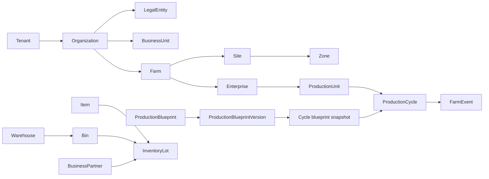

# Core Domain Model

> **Status: Authoritative (M02).** Entity property detail is completed by the owning milestone without changing these identities/ownership rules.

## Identity and relationships

- `Tenant` is the commercial/security/isolation boundary. It owns organizations and entitlements.
- `Organization` is the customer operating umbrella; a `LegalEntity` is an accounting/legal party within it; a `BusinessUnit` is an optional management dimension. Neither is synonymous with Tenant or Farm.
- `Farm` is an operational location with IANA timezone. `Site`/`Zone` are optional physical subdivisions.
- `Enterprise` is an enabled line of production (for example broiler). `ProductionUnit` is a physical container such as house, pond, field, or barn.
- `ProductionCycle` is the common time-bounded biological and economic aggregate. At most one conflicting active cycle may occupy a production unit for a given occupancy mode.
- `ProductionBlueprint` owns an immutable sequence of `ProductionBlueprintVersion` records. Cycle start creates/references an immutable cycle snapshot containing resolved system/tenant/farm configuration and semantic versions.
- `IndividualAnimal` belongs to the future Livestock context and may participate in cycles without changing the cycle kernel.
- `Item`/`ItemCategory`/`UnitOfMeasure` are Catalog-owned and shared across verticals. Item policy declares stocking, lot/serial, expiry, traceability, purchase/sale/base UOM behavior.
- `BusinessPartner` is a shared party with supplier/customer/etc. roles; commercial modules own their role-specific accounts/contracts.
- `Warehouse`/`Bin`/`InventoryLot` are Inventory-owned; a lot identifies traceable material, while quantity by location/state comes from the stock ledger/projection.
- `FarmEvent` is an immutable Production journal fact linked to the relevant cycle/entity and provenance; it is not the integration outbox or audit log.

## ProductionCycle invariant set

The cycle carries farm, enterprise, unit, type, code, lifecycle, planned/actual dates, blueprint snapshot ID, cost-center ID, target UOM values, and concurrency version. Lifecycle transitions are explicit. A started cycle cannot change tenant/farm/unit/type/blueprint snapshot. Events require compatible lifecycle and occurred time; close requires reconciliation of biological quantity, open harvest, and material issues per vertical policy.

Cycle costs may be attributed for biological stock, feed/seed/fertilizer, medicine/chemicals, labor, utilities/fuel, equipment/depreciation/maintenance, transport, consumables/packaging, and overhead along dimensions organization, farm, enterprise, unit, cycle, item/product, and cost center. Finance owns values/postings; Production owns causal attribution references.

## Quantity, time, and money value objects

- `Quantity { value: decimal, uomId }`; conversions require matching dimension and an effective-dated approved factor. Count is integral where the domain requires it. Store source and canonical quantities when conversion reproducibility matters; rounding is use-case/UOM policy.
- `Money { amount: decimal, currency: ISO-4217 }`; calculations require same currency or an explicit versioned rate. PostgreSQL `numeric`, never float. Rounding mode/scale is currency and accounting-policy controlled.
- Occurrence uses `timestamptz` UTC plus optional source offset/timezone metadata; `occurred_at` is physical time and `recorded_at` is server receipt. Farm business date is derived from the farm’s versioned IANA timezone.
