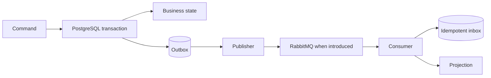

# Domain and Integration Eventing

> **Status: Authoritative (M02).** RabbitMQ introduction is **Deferred** until asynchronous consumers are implemented.

Domain events are in-process module facts used within an application transaction. Integration events are stable post-commit contracts. The application transaction atomically commits business state and an outbox record containing event ID/type/version, trusted tenant, producer, occurred/recorded times, subject, correlation/causation, trace context and payload.

The publisher claims rows safely, publishes at least once, records attempts/status and retries with backoff; poison messages reach an operational dead-letter path with alert/replay controls. Consumers assume duplicates/out-of-order delivery, use an inbox, validate schema/version, and commit inbox+effect atomically. Ordering is guaranteed only where explicitly designed per aggregate/partition with sequence/version; consumers must detect stale versions.

Events are not remote procedure calls and contain only necessary safe data. Producers own schemas. Breaking semantic/payload changes create a new major version/name mapping; additive optional fields are compatible. Correlation follows the initiating workflow; causation identifies the direct command/event.
