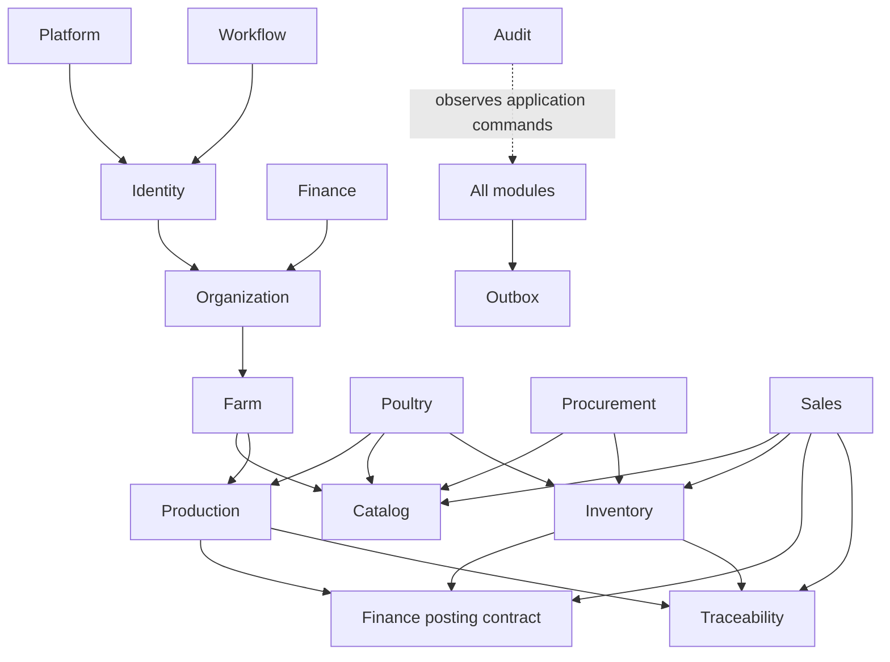

# Module Dependency Rules

> **Status: Authoritative (M02).**

## Rules

1. A module owns its tables, aggregates, commands, and vocabulary. Other modules may use only its public application contracts, stable identifiers/read models, or published integration events.
2. No cross-module repository, `DbSet`, or direct table mutation. Foreign keys may preserve integrity, but do not grant write ownership.
3. Synchronous calls are used only when the initiating transaction requires an immediate invariant/result. Post-commit projections, notifications, and integrations use outbox events.
4. Domain projects depend only on their own domain and a deliberately small building-block library (ID, clock abstractions, result types); there is no giant shared domain.
5. Vertical modules depend inward on common Production/Catalog/Inventory contracts; the common kernel never depends on Poultry/Livestock/Fisheries/Crops.
6. Cycles are broken through orchestration in an application service or an event, never mutual domain references.

The arrows mean “may call/use the public contract of,” not table ownership. Finance consumes authoritative source consequences; it does not reach into source tables. Analytics, Tasks, Notifications, Audit, and AI Integration consume public queries/events and must not become alternate authorities.

## Representative orchestration

For feed issue, Poultry validates the active flock/cycle, Inventory atomically validates and posts the lot issue through its contract, Production records consumption/event, Finance receives a cost source reference, Traceability records genealogy, and all records share correlation/causation. Until distributed services exist, a single application orchestration transaction provides atomicity.

## Forbidden edges

- Production -> Poultry or another vertical.
- Inventory -> a vertical-specific table.
- Finance -> direct mutation of source transaction tables.
- Analytics/UI/AI -> authoritative writes or balance calculations.
- Control-plane admin -> customer data without explicit audited support policy.
