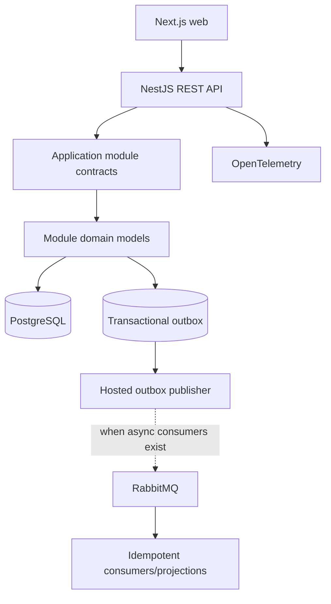
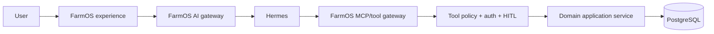

# FarmOS System Architecture

> **Status: Authoritative (M02, amended by M02A).** Technology introduction timing remains milestone-controlled.

## Architecture

FarmOS starts as a deployable modular monolith: Next.js web plus a strict-TypeScript NestJS REST API/background worker on Node.js 24 LTS, backed by PostgreSQL. Control-plane and ERP data-plane modules are logically separated in code, authorization, and schemas but initially share the deployment and database cluster. Redis, RabbitMQ, S3-compatible storage, TimescaleDB, pgvector, and separate workers are introduced only when their owning milestone demonstrates need.



Each module contains API/application/domain/infrastructure layers. Domain code has no web or persistence dependency. Application services establish authorization and transaction boundaries. Infrastructure implements repositories and adapters. HTTP endpoints never contain authoritative business arithmetic.

## Backend stack

- Node.js 24 LTS, strict TypeScript and NestJS controllers/modules/providers/guards/interceptors.
- Drizzle ORM with `pg` for typed PostgreSQL schemas and normal queries; Drizzle Kit produces reviewed, version-controlled SQL migrations.
- Parameterized Drizzle SQL or a transaction-scoped `pg` client is permitted behind module-owned repositories for RLS context, locking, isolation, specialized constraints and projection performance. It must use the same transaction connection.
- PostgreSQL; schema-per-module logical boundaries in one database.
- NestJS dependency injection, authentication/authorization guards/policies, generated OpenAPI, health checks and application lifecycle facilities.
- Vitest for unit/architecture tests; Nest testing + Supertest for API/E2E; Testcontainers against real PostgreSQL for integration, RLS and tenant-isolation tests.
- OpenTelemetry JavaScript instrumentation; structured logs with correlation context.

Package choices beyond these capabilities are made in implementation and pinned centrally; no CQRS framework, mapping framework, workflow engine, broker or cache is mandatory by M02/M02A.

## Repository shape

```text
apps/
├── web/                         Next.js frontend
└── api/                         NestJS composition root and HTTP/bootstrap
packages/
├── building-blocks/             API, auth, tenancy, persistence, audit, events
└── modules/
    ├── platform/
    ├── identity/
    ├── organization/
    └── farm/                    M03 modules; later modules follow the same shape
tests/
├── architecture/
├── integration/
├── tenant-isolation/
└── e2e/
```

Each module exposes explicit public entry points and internally separates domain, application, infrastructure and API adapters. TypeScript path aliases/package exports and restricted-import tests enforce direction; a shared package contains technical primitives, not a shared business-domain dumping ground.

## Request/command flow

`HTTP endpoint -> trusted context -> entitlement/authorization -> application command -> domain validation -> one database transaction (state + audit + outbox + idempotency result) -> response`. Queries use module-owned query services/read projections and never bypass tenant policy.

## AI boundary



Hermes reasons, converses, selects tools, and summarizes. It is not a tenant authority, ledger, approval authority, or database access layer.

## Deployment evolution

The initial API and worker may ship together in Docker. IoT ingestion, notifications, document processing, analytics, and AI gateway are extraction candidates only after measured scaling/security/deployment pressure. No distributed transaction is used: synchronous module contracts protect atomic invariants; outbox events handle post-commit work.
