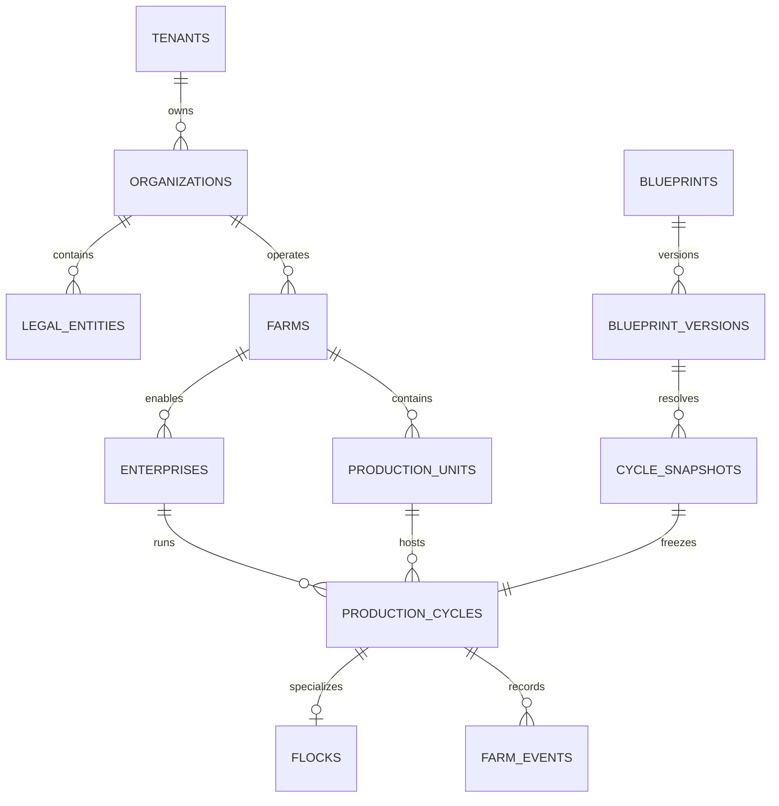
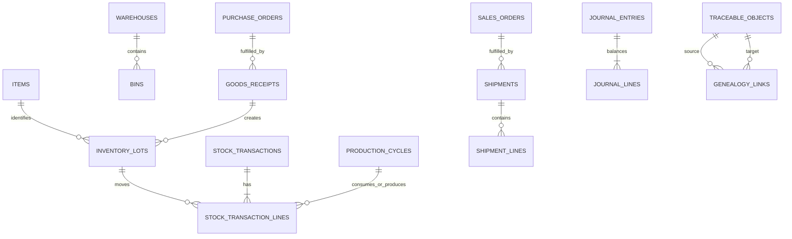

# PostgreSQL ERD v1

> **Status: Authoritative logical/physical baseline (M02).** Column lists focus on keys, scope, lifecycle and integrity. M03/M06+ migrations add non-conflicting detail in owning milestones.

## Core hierarchy

## Inventory/commercial/finance/trace links

## Table inventory and constraints

All tenant tables include `tenant_id`, audit timestamps and the indexes prescribed by `SCHEMA_RULES.md`.

| Schema/table | Key fields and foreign keys | Important constraints/indexes |
|---|---|---|
| `platform.tenants` | `id PK`, code, status, default_locale | unique normalized code; status index |
| `platform.entitlements` | `id PK`, `tenant_id FK`, capability, effective range | unique tenant/capability/range policy |
| `identity.users` | `id PK`, normalized email, status | global login uniqueness policy; no ERP scope |
| `identity.memberships` | `id PK`, tenant/user FK, status | unique tenant/user |
| `identity.roles`, `permissions`, `role_permissions`, `user_roles` | scoped IDs/FKs, scope type/id, effective range | unique grants; tenant/scope indexes |
| `identity.farm_assignments`, `sessions`, `api_clients` | membership/farm or subject/session FKs | revocation/expiry indexes; hashed token/secret only |
| `organization.organizations`, `legal_entities`, `business_units` | tenant-scoped PK/FKs; currency/timezone where owned | unique tenant code; tenant/name indexes |
| `farm.farms`, `sites`, `zones` | organization/farm hierarchy FKs | unique tenant code; IANA timezone; parent tenant FKs |
| `farm.enterprises`, `production_units` | farm FK, type, capacity quantity/UOM, status, version | unique tenant/farm code; active unit index |
| `catalog.uoms`, `uom_conversions` | dimension, code, from/to, factor, effective range | unique code/dimension; no overlapping contradictory conversion |
| `catalog.item_categories`, `items` | category/base UOM FK, policy flags, version | unique tenant code; active/type indexes |
| `catalog.business_partners` | tenant PK, code, roles, status | unique tenant code; normalized-name index |
| `production.blueprints`, `blueprint_versions` | owner scope; immutable version/config JSONB | unique blueprint/version; published version immutable |
| `production.cycle_snapshots` | blueprint-version FK, config/hash | immutable; hash/index |
| `production.production_cycles` | farm/enterprise/unit/snapshot/cost-center FKs, status, dates, version | unique tenant code; unit/status index; exclusion/partial uniqueness for conflicting active occupancy |
| `production.farm_events` | cycle/entity refs, event type/version, occurrence/provenance/quantity | unique tenant/source/idempotency where supplied; cycle/occurred and entity indexes; append-only |
| `poultry.flocks` | cycle FK unique, placement/live projection/version | one flock per cycle |
| `poultry.placements`, `mortalities`, `culls`, `weight_samples`, `health_records`, `vaccinations`, `harvests` | flock/cycle/source/lot refs, occurred time, quantities | positive checks; source command unique; flock/time indexes; append/correction semantics |
| `inventory.warehouses`, `bins` | farm/warehouse FKs, status | unique tenant/farm or warehouse code |
| `inventory.inventory_lots` | item/partner/source refs, lot code/dates/quality | tenant/item/lot uniqueness policy; expiry/status indexes |
| `inventory.stock_transactions`, `stock_transaction_lines` | source, type, location/state/item/lot/cycle, signed quantities, valuation ref | unique source command; append-only; item/location/time indexes |
| `inventory.stock_positions` | item/lot/bin/state, quantity, version | unique composite position; nonnegative controlled states |
| `inventory.stock_reservations`, `transfers`, `stock_counts` | resource/source/lifecycle/version | source uniqueness; open-status indexes |
| `procurement.purchase_requisitions`, `purchase_orders`, line tables, `goods_receipts` | partner/workflow/warehouse/source FKs, totals/currency/status/version | unique tenant document number; status/date indexes; received <= ordered policy |
| `sales.customers`, `sales_orders`, allocations, `shipments`, shipment lines, invoice sources | partner/item/lot refs, money/status/version | unique document numbers; allocation/source constraints |
| `finance.accounts`, `cost_centers`, `budgets` | legal entity hierarchy/scope/version | unique entity code; effective-status indexes |
| `finance.journal_entries`, `journal_lines` | legal entity/period/source/reversal; account, debit/credit, dimensions | unique source posting; posted immutable; account/date indexes |
| `finance.payables`, `receivables`, `payments` | partner/source/currency/status/version | source uniqueness; due/status indexes |
| `workflow.workflow_definitions`, versions, instances, approval_requests, decisions | resource/policy/actor refs | immutable versions/decisions; pending approver indexes |
| `traceability.traceable_objects`, `trace_events`, `genealogy_links`, `shipment_traces` | typed source/target/location/shipment refs | cross-tenant prohibited; source/target traversal indexes; append-only |
| `audit.audit_records` | actor/target/action/context/diff hash/correlation | append-only; tenant/time, target/time, correlation indexes |
| `integration.idempotency_records` | tenant/principal/operation/key/fingerprint/result/status | unique scope+key; status/time index |
| `integration.outbox_messages`, `inbox_messages` | event envelope/publish state; consumer/event | unique event ID and consumer/event; pending partial index |

Cross-module FKs are permitted for integrity where deployment/migration ownership is coordinated, but only the owning module writes its table. High-volume FarmEvent/audit/ledger/outbox partitioning is deferred until measured.
